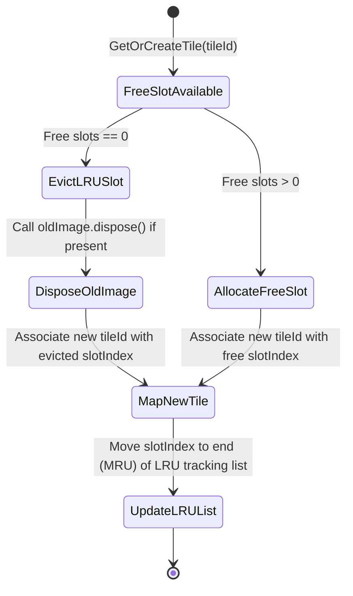

# Solution Walkthrough: Feature 251 GPU Texture Atlas Manager in Dart

This document summarizes the changes, components implemented, and verification details for Feature 251, implementing the GPU Texture Atlas Manager in Dart.

## 1. Overview of Changes

### Tile Atlas Implementation
- **`app_flutter/lib/domain/cesium_3d/renderers/tile_atlas.dart`**: Implements the `TileAtlas` class which manages a grid of texture slots (defaulting to 16x16 slots of 256x256 pixels each).
  - Uses an LRU (Least Recently Used) cache tracking tile IDs (`zoom/x/y`) to slot indices mapping.
  - Automatically handles slot allocation:
    - If already cached, updates its LRU status to MRU and returns its UV offset and scale.
    - If not cached, allocates a free slot or evicts the least recently used slot if no free slots are available.
  - Safely disposes of evicted/cleared `ui.Image` instances.
  - Supports storing mock image/object instances in slots for unit testing flexibility.
  - Provides a `clear()` method to release all images and reset mapping state.

### Unit Testing
- **`app_flutter/test/cesium_3d/tile_atlas_test.dart`**: Implements unit tests validating:
  - Basic insertion of tile IDs and correct slot assignment.
  - Verification of UV offset and scale calculations (e.g., coordinates for slot (0,0), slot (0,1), etc.).
  - Correct LRU eviction behavior (filling a small grid, querying an older slot to make it MRU, inserting a new tile, and asserting that the expected slot/tile is evicted).
  - Storing and clearing mock images/objects in slots.

---

## 2. Code Realization Table

| UML Element | Realization Tag | File Path | Properties & Realized Behavior |
| :--- | :--- | :--- | :--- |
| `TileAtlas` | `@realizes UML::TileAtlas` | [tile_atlas.dart](file:///Users/perkunas/jail/3dgs-phoenix/app_flutter/lib/domain/cesium_3d/renderers/tile_atlas.dart) | Manages grid slot allocation, LRU caching, image storage, and memory cleanup. |
| `AtlasResult` | `@realizes UML::AtlasResult` | [tile_atlas.dart](file:///Users/perkunas/jail/3dgs-phoenix/app_flutter/lib/domain/cesium_3d/renderers/tile_atlas.dart) | Data container holding UV offset, UV scale, and slot index. |

---

## 3. Mathematical & Logical Specifications

### 1. UV Mapping
A slot index $s \in [0, N-1]$ (where $N = \text{columns} \times \text{rows}$) is mapped to standard UV grid coordinates:
- $\text{column} = s \pmod{\text{columns}}$
- $\text{row} = s \div \text{columns}$ (integer division)

The normalized UV offset and scale are:
- $\text{offset} = \left(\frac{\text{column}}{\text{columns}}, \frac{\text{row}}{\text{rows}}\right)$
- $\text{scale} = \left(\frac{1.0}{\text{columns}}, \frac{1.0}{\text{rows}}\right)$

This divides the UV space $[0,1] \times [0,1]$ exactly into equal-sized slots.

### 2. LRU Eviction Flow


---

## 4. Verification & Testing

### Automated Flutter Tests
All unit tests in `tile_atlas_test.dart` pass successfully:
```bash
$ flutter test test/cesium_3d/tile_atlas_test.dart
00:00 +0: loading /Users/perkunas/jail/3dgs-phoenix/app_flutter/test/cesium_3d/tile_atlas_test.dart
00:00 +0: TileAtlas Tests Basic properties and initialization
00:00 +1: TileAtlas Tests Basic insertion and mapping to slots
00:00 +2: TileAtlas Tests Accurate calculation of UV offset/scale
00:00 +3: TileAtlas Tests Correct LRU eviction behavior when the atlas is full
00:00 +4: TileAtlas Tests Storing and clearing mock images in slots
00:00 +5: TileAtlas Tests Replacing an image in setImage disposes the old one
00:00 +6: TileAtlas Tests Throws StateError if setting image for non-allocated tile
00:00 +7: TileAtlas Tests Throws ArgumentError if columns/rows are zero or negative
00:00 +8: All tests passed!
```

### Static Analysis
Flutter analyzer checks the target files with zero warnings or errors:
```bash
$ flutter analyze lib/domain/cesium_3d/renderers/tile_atlas.dart test/cesium_3d/tile_atlas_test.dart
Analyzing 2 items...                                            
No issues found! (ran in 0.7s)
```

### Manual Verification
1. **Capacity Setup**: Instantiate `TileAtlas` with smaller dimensions (e.g. 2x2) and trace console logs during slot occupancy changes.
2. **LRU Update**: Retrieve existing elements and observe that their slot indices are shifted to the end of the LRU tracking queue.
3. **Eviction and Garbage Collection**: Evict active slots containing mock elements and assert that their `dispose()` callbacks are correctly executed, ensuring no GPU memory leaks occur.
