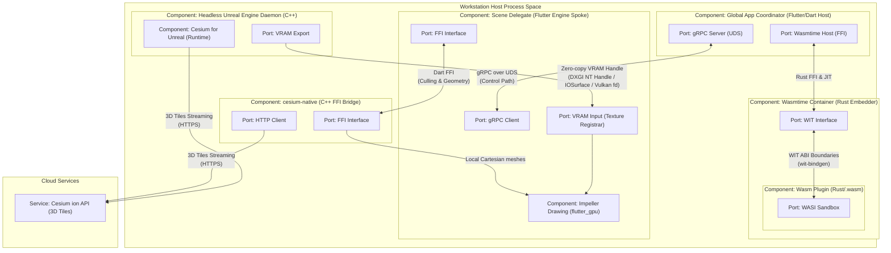
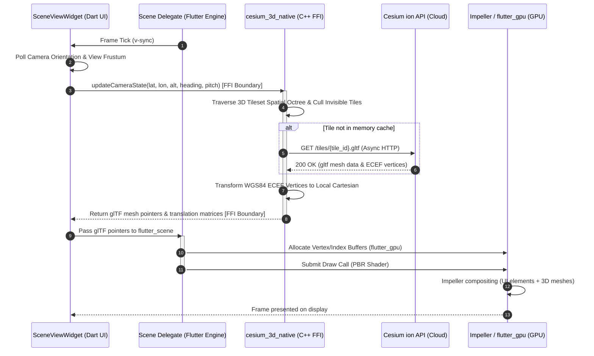
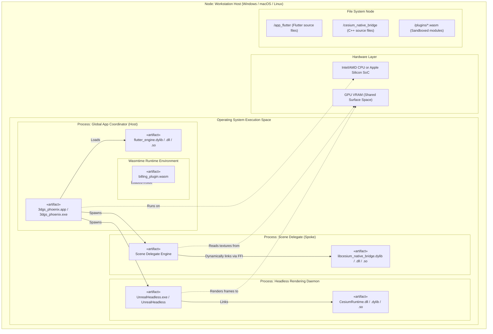

# UML Graphics and WebAssembly Extensibility Design Specification

This document details the Unified Modeling Language (UML) design specification for the cross-platform 3D network visualization and extensibility platform. It outlines the architectural boundaries, process interactions, rendering pipelines, and dynamic WebAssembly sandboxing paradigms that govern the platform's execution across Windows, macOS, and Linux.

---

## 1. Architectural System Overview

The platform uses a **multi-process, Hub-and-Spoke topology** engineered to provide strict fault segregation, low-latency UI responsiveness, and native-level 3D graphics rendering.

```
       +-------------------------------------------------------------+
       |             GLOBAL APP COORDINATOR (Dart/Flutter)            |
       |  - Main Process, UI Window Manager, gRPC UDS Server         |
       |  - Wasmtime Runtime Host & Cranelift JIT                    |
       +-------+-------------------------+--------------------+------+
               |                         |                    |
       gRPC over UDS                     |             Host FFI (WIT)
  (Control & Registration)      Zero-Copy VRAM Handles        |
               |             (DXGI/IOSurface/Vulkan fd)       |
               v                         |                    v
+-----------------------------+          |             +--------------+
|     SCENE DELEGATE 1        |          |             | WASM PLUGIN  |
|  - Spoke Flutter Process    |          |             | - Rust VM    |
|  - UI & 3D Layer Compositor |          |             | - Sandboxed  |
+--------------+--------------+          |             +--------------+
               |                         |
        Dart FFI Boundary                v
               |          +----------------------------+
               v          |  HEADLESS RENDERING DAEMON |
+-----------------------+ |  - C++ Unreal Engine 5     |
|   cesium-native C++   | |  - Cesium ion 3D Tileset   |
|  - Spatial Culling    | +----------------------------+
|  - ECEF Transformation|
+-----------------------+
```

### 1.1 The Hub-and-Spoke Process Topology
- **Global App Coordinator (Hub):** The central orchestration process. Bootstrapped as the primary Flutter application, it manages system configuration, orchestrates child process lifecycles, and hosts the sandboxed `Wasmtime` execution environment. It communicates with the UI scenes and renderer daemons via localized inter-process communication (IPC).
- **Scene Delegates (Spokes):** Independent operating system processes running lightweight Flutter engine viewports. Each window scene (e.g., custom topology views or network diagnostic panels) operates in its own OS process, preventing graphics crashes or shader compiler deadlocks in one scene from compromising the main application window.
- **Headless Rendering Daemon:** An offscreen execution process running Unreal Engine equipped with the Cesium for Unreal runtime. This daemon streams massive geospatial datasets directly from the Cesium ion cloud platform and renders them to offscreen GPU framebuffers.

### 1.2 IPC & Zero-Copy GPU Memory Architecture
To avoid the severe bandwidth bottlenecks of transferring high-resolution 60 FPS frames through system RAM, the platform establishes zero-copy GPU memory paths:
- **Control Path:** Low-overhead metadata, user events, and configuration parameters are transmitted using **gRPC over Unix Domain Sockets (UDS)**.
- **Data/Render Path:** Rendered 3D framebuffers are kept entirely in VRAM. The Headless Rendering Daemon exports its offscreen surface handles, which are imported directly by the Scene Delegate's Flutter Texture registrar and composited onto the screen via the Impeller engine.
  - *Windows:* Direct3D 12 texture pointers are shared via DXGI NT handles (`kFlutterDesktopGpuSurfaceTypeDxgiSharedHandle`).
  - *macOS:* Apple Metal textures are wrapped in CoreVideo IOSurfaces (`IOSurfaceRef`) using unified memory (`MTLStorageModeShared`).
  - *Linux:* Vulkan textures are bridged using the `VK_KHR_external_memory_fd` extension over Unix domain sockets.

### 1.3 Native "Lite Mode" Pipeline
For low-power devices, the Scene Delegate process hosts a native rendering pipeline that bypasses the Unreal Engine daemon entirely. It utilizes the `cesium_3d_native` C++ library bound to Dart via FFI to stream 3D Tilesets, compute camera view-frustum culling, translate WGS84 Earth-Centered, Earth-Fixed (ECEF) coordinates to local Cartesian metrics, and pass resulting glTF meshes directly to `flutter_scene` for hardware-accelerated drawing on the Impeller backend.

---

## 2. Detailed OMG UML 2.5.1 Compliant Mermaid Diagrams

### 2.1 Component Diagram

The Component Diagram details the ports, interfaces, and structural dependencies between the subsystems. Named ports are used to delineate boundaries (e.g., gRPC, FFI, and GPU surface handles).



---

### 2.2 Sequence Diagram: Native Render Loop (Lite Mode)

This sequence diagram traces a single frame tick within the native "Lite Mode" rendering pipeline, showing how camera coordinates are passed via FFI to cesium-native, culled, converted, and rasterized on the Impeller canvas.



---

### 2.3 Sequence Diagram: WebAssembly Plugin Async Event Loop

This diagram models the life-cycle of an asynchronous extension invocation. It details Cranelift JIT bounds, WIT type-marshaling boundaries, sandboxed WASI filesystem queries, and asynchronous context yielding.

```mermaid
sequenceDiagram
    autonumber
    participant Coord as Coordinator (PluginManager - Dart)
    participant Host as WasmtimeHost (Rust/C Embedder)
    participant JIT as Cranelift JIT Compiler
    participant WIT as WIT Boundary (wit-bindgen)
    participant Guest as Wasm Plugin (Guest VM)
    participant WASI as WASI Sandbox (Virtual FS)

    Coord->>Host: Initialize & Load Plugin Bytecode (.wasm)
    activate Host
    alt Bytecode not cached
        Host->>JIT: Compile Bytecode (JIT Compilation Bounds)
        JIT-->>Host: Machine Code (Native Executable)
    end
    deactivate Host

    Note over Coord, Guest: Asynchronous Event Loop Execution
    Coord->>Coord: Trigger Event (e.g., Network Payload Ingestion)
    Coord->>WIT: Invoke WIT function: process_payload(data) (Async Call)
    activate WIT
    WIT->>WIT: Marshal complex records & arrays to guest memory
    WIT->>Guest: Call Guest Entrypoint
    activate Guest

    Guest->>WASI: fd_read(sandboxed_dir_fd, path) (WASI FS Access Request)
    activate WASI
    WASI->>WASI: Validate capability bounds & map virtual path to host OS
    WASI-->>Guest: Return file descriptor handle & data bytes
    deactivate WASI

    Guest->>Guest: Execute business logic / parse protocol

    alt Long-Running / I/O Wait
        Guest->>Host: Yield execution (async-yield / coroutine)
        deactivate Guest
        Host-->>Coord: Return control to Dart Event Loop (Unblock Coordinator)
        Note over Coord: Dart execution continues; frame renders at 60 FPS
        Coord->>Host: Resume task (Event loop notifies async I/O completion)
        activate Guest
    end

    Guest-->>WIT: Return raw result data
    deactivate Guest
    WIT->>WIT: Unmarshal guest output to Dart types (records/results)
    WIT-->>Coord: Return processed event response
    deactivate WIT
```

---

### 2.4 Deployment Diagram

The Deployment Diagram defines the physical mapping of software artifacts (executable binaries, dynamically linked libraries, and sandboxed bytecode) to target operating system node environments and execution memory layouts.



---

## 3. Traceability Matrix

This matrix traces components from Section 2 to the technical requirements defined in the **Software Architectural Specification** (`docs/architecture/Architecture-spec-Cross-Platform-Rendering-and-WebAssembly.md`).

| Component / Diagram | Req. ID | Spec Requirement Name | Implementation Detail & Mapping | Verification Hook |
| :--- | :--- | :--- | :--- | :--- |
| **Component Diagram** | `1.1` | Process Spawning | Coordinator parses `--scene=[id]` arguments to launch Scene Delegates via `Process.start()`. | `main()` argument parsing tests. |
| **Component Diagram** | `1.2` | Fault Segregation | Independent Scene Delegate processes prevent Impeller crashes from impacting the Coordinator. | Process crash isolation test sweeps. |
| **Deployment Diagram** | `1.3` | macOS Compliance | Launched with `LSUIElement` key set to true in macOS helper application `Info.plist`. | Plist validation in CI build scripts. |
| **Deployment Diagram** | `2.1` | Headless Unreal Orchestration | Coordinator spawns Unreal Engine with the `-RenderOffscreen` flag. | Process monitor diagnostics. |
| **Component Diagram** | `2.2` | Windows DXGI Interop | Unreal outputs to a DXGI handle mapped using `kFlutterDesktopGpuSurfaceTypeDxgiSharedHandle`. | Windows TextureRegistrar bindings verification. |
| **Component Diagram** | `2.3` | macOS IOSurface Interop | Unreal framebuffers map via CVPixelBuffers backed by `IOSurfaceRef` with `MTLStorageModeShared`. | CoreVideo/Metal console validation. |
| **Component Diagram** | `2.4` | Linux Vulkan Interop | Vulkan frames pass to the coordinator via the `VK_KHR_external_memory_fd` socket bridge. | Vulkan extension queries in Linux environments. |
| **Sequence Diagram (Render)** | `3.1` | Spatial Logic Engine | `cesium_3d_native` streams 3D Tiles, performs frustum culling, and outputs in-memory glTF. | Frustum culling and caching test assertions. |
| **Sequence Diagram (Render)** | `3.2` | Coordinate Transformation | High-precision FFI math translates WGS84 ECEF coordinates to localized Cartesians. | FFI vector transform correctness checks. |
| **Sequence Diagram (Render)** | `3.3` | Native UI Compositing | glTF meshes composite natively using `flutter_scene` on top of the Impeller backend. | Frame-time telemetry showing low frame delta times. |
| **Sequence Diagram (WASM)** | `4.1` | Wasmtime Runtime | Rust-embedded `wasmtime` engine utilizes the Cranelift JIT compiler for execution. | Cranelift configuration validation tests. |
| **Sequence Diagram (WASM)** | `4.2` | WASI Sandbox | Plugins execute inside a restricted WASI sandbox, with virtual filesystem bounds enforced. | Directory capability checks. |
| **Sequence Diagram (WASM)** | `4.3` | WIT Interfaces | Type-safe boundary structures (wit-bindgen generated) prevent raw pointer marshalling errors. | WIT interface linter checks. |
| **Sequence Diagram (WASM)** | `4.4` | Asynchronous Batching | Async yielding and micro-task queuing prevent FFI execution locks during UI updates. | Event loop latency profile runs. |
