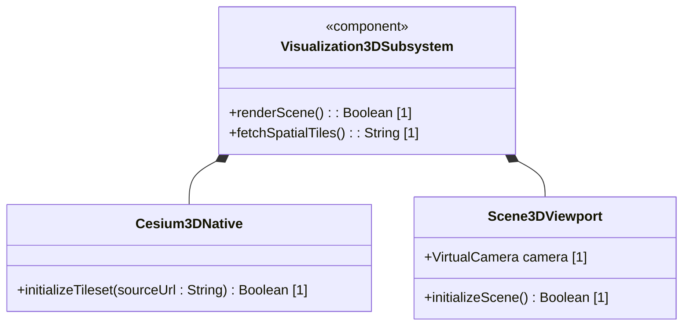
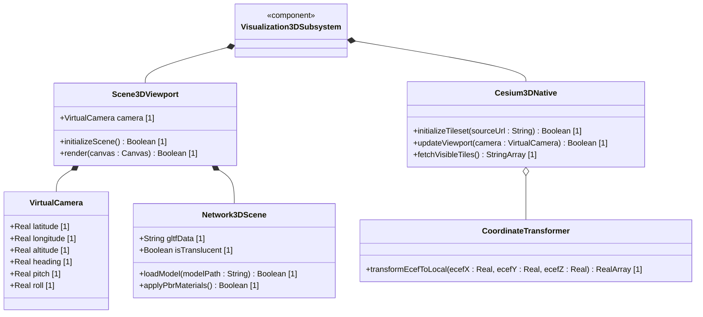
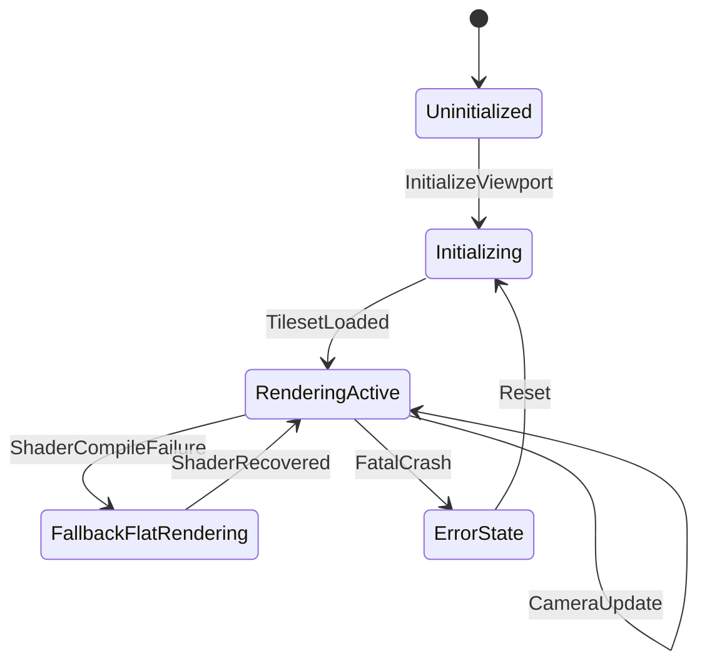

# Epic: 3D Visualization Epic

## 1. Context
The 3D Visualization Epic aggregates high-performance native rendering pipelines required to establish a native, single-process desktop 3D network topology visualization. By interfacing the C++ spatial logic library `cesium-native` (via Dart FFI) with Flutter's low-level `flutter_gpu` and high-level `flutter_scene` libraries, the subsystem renders global-scale photorealistic tilesets and logical microwave line-of-sight (LoS) links directly in the Flutter viewport without embedded webviews or multi-process sharing mechanisms.

## 2. Requirements & Checklist
- [ ] #239 - [Feature 01: Native Desktop 3D Network Visualization](https://github.com/gintatkinson/3dgs-phoenix/blob/main/docs/features/feat-01-native-3d-network-visualization.md) (Aggregates high-performance native rendering pipelines)
- [ ] #245 - [Feature 02: 3D Terrain Elevation and Node Altitude Modeling](https://github.com/gintatkinson/3dgs-phoenix/blob/main/docs/features/feat-02-3d-terrain-elevation-and-node-altitude-modeling.md) (Renders dynamic terrain and ground altitudes)

### Associated Use Cases & User Stories

#### Associated Use Cases
None identified at this time.

#### Associated User Stories
## 3. Architecture

### Subsystem Component Definition
Define the subsystem representing the Epic as a UML Component specifying provided/required interfaces and operations.

## System-Level UML Class Diagram

## System State Machine Diagram

## 4. Operational Considerations
To achieve stable 60 FPS rendering rates, the 3D visualization engine leverages zero-copy native VRAM buffer sharing. Buffers must be allocated dynamically with appropriate dimensions matching the active Flutter Texture size. The system must support hot-swapping memory handles on the fly if the rendering pipeline crashes.

## 5. Security & Governance
FFI bindings into C++ cesium-native must validate memory bounds to prevent buffer overflows or memory leaks in the Flutter runner process. Native textures and shared handles must only be shared with authorized helper processes in the parent-child hierarchy.

## 6. Source References
Structural Schema: `app_flutter/assets/logical-layout.json`
Normative Specification: Architectural Blueprint: Native Desktop 3D Network Visualization with Flutter and Cesium
