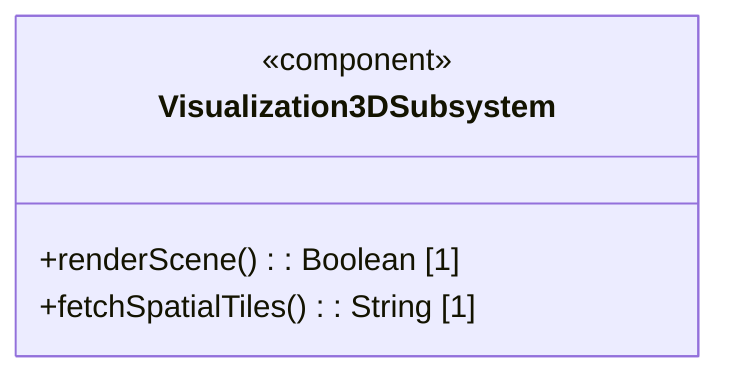
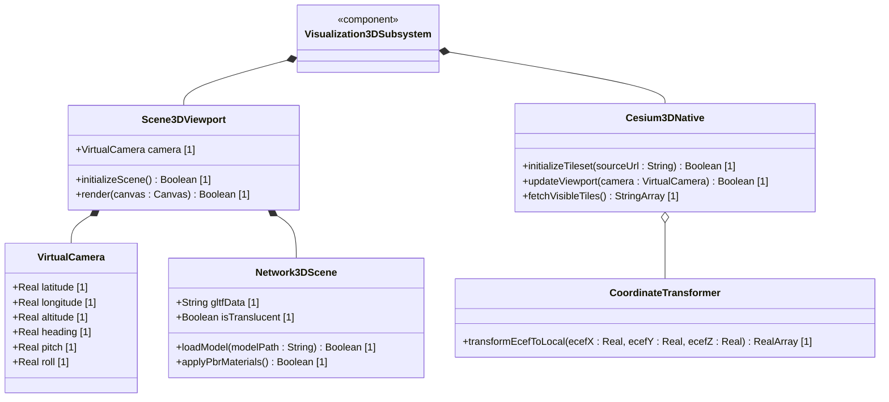
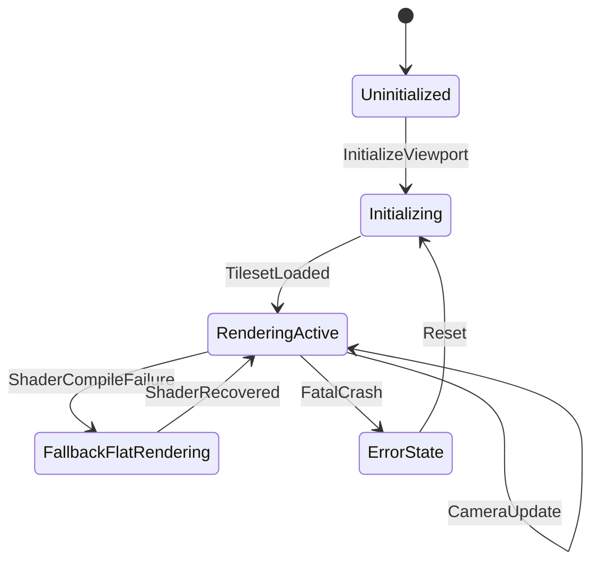

# Epic: 3D Visualization Epic

## 1. Context
The 3D Visualization Epic aggregates high-performance native rendering pipelines required to establish a native, single-process desktop 3D network topology visualization. By interfacing the C++ spatial logic library `cesium-native` (via Dart FFI) with Flutter's low-level `flutter_gpu` and high-level `flutter_scene` libraries, the subsystem renders global-scale photorealistic tilesets and logical microwave line-of-sight (LoS) links directly in the Flutter viewport without embedded webviews or multi-process sharing mechanisms.

## 2. Requirements & Checklist
- [ ] #239 - Feature 01: Native Desktop 3D Network Visualization (https://github.com/gintatkinson/3dgs-phoenix/blob/main/docs/features/feat-01-native-3d-network-visualization.md) (Aggregates high-performance native rendering pipelines)
- [ ] #245 - Feature 02: 3D Terrain Elevation and Node Altitude Modeling (https://github.com/gintatkinson/3dgs-phoenix/blob/main/docs/features/feat-02-3d-terrain-elevation-and-node-altitude-modeling.md) (Renders dynamic terrain and ground altitudes)
- [ ] #256 - Feature 20: Subdivided Geodetic Mesh Generator (https://github.com/gintatkinson/3dgs-phoenix/blob/main/docs/features/feat-20-geodetic-icosphere-generator.md) (Tessellates icosahedron into geodetic unit sphere mesh)
- [ ] #258 - Feature 22: SSE LOD & Horizon Culling Engine (https://github.com/gintatkinson/3dgs-phoenix/blob/main/docs/features/feat-22-sse-lod-culling-engine.md) (Calculates Screen Space Error thresholds, frustum culling, and horizon culling)

### Associated Use Cases & User Stories

#### Associated Use Cases
None identified at this time.

#### Associated User Stories
## 3. Architecture and System Interaction Diagrams

### Subsystem Component Definition
Define the subsystem representing the Epic as a UML Component specifying provided/required interfaces and operations.

## System-Level UML Class Diagram

## 4. State Machine Definitions

## System State Machine Diagram

## 5. Specification Context
The 3D Visualization Epic serves as the primary container for spatial, geographical, and topographical representation within the 3DGS Phoenix workspace. The scope spans the low-level FFI C++ bridge bindings up to the high-level Flutter interface widgets (`TopographicalView`) that display nodes, microwave links, elevation profiles, and 3D tiles.

## 6. Source References
Structural Schema: `app_flutter/assets/logical-layout.json`
Normative Specification: Architectural Blueprint: Native Desktop 3D Network Visualization with Flutter and Cesium
