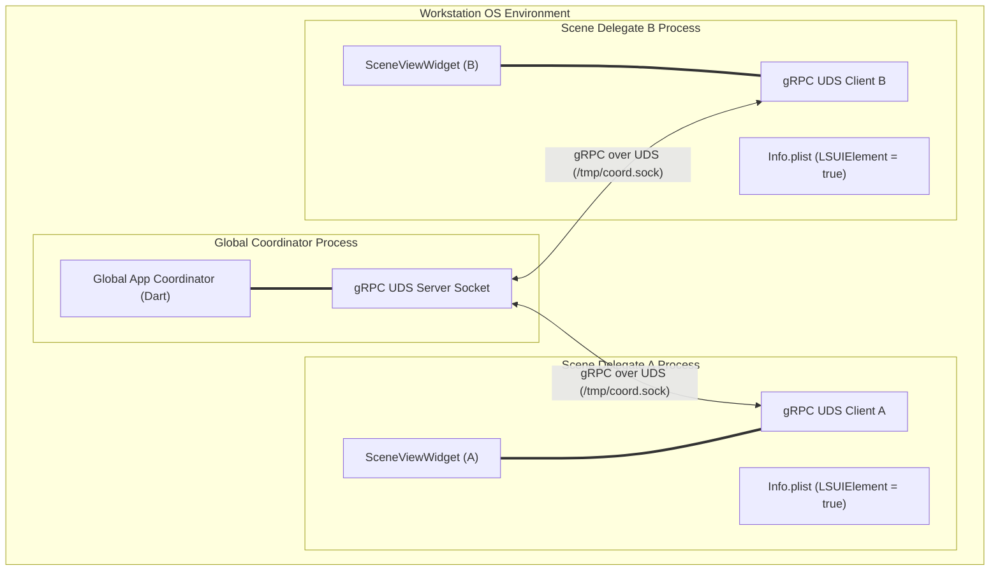
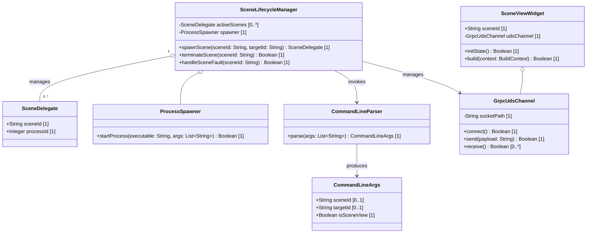
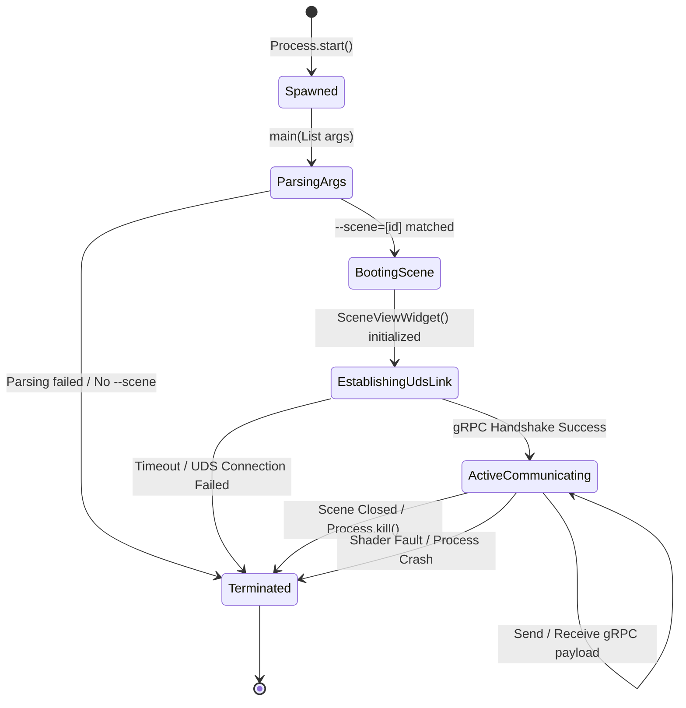

# Epic: Platform-Agnostic Scene-Based Lifecycle (Windowing)

## 1. Context
To deliver a high-performance, robust, and platform-agnostic 3D network topology visualization, the system architecture employs a multi-process, Hub-and-Spoke model. Instead of hosting multiple rendering workloads and sub-windows inside a single monolithic OS process—which risks cascading application crashes—the platform enforces strict process boundary segregation. 

The application architecture distinguishes between two key process roles:
*   **Global App Coordinator**: The central coordinator process running in Dart/Flutter. It is responsible for managing global state, network and orchestration daemons, active workspaces, and the embedded WebAssembly (`wasmtime`) plugin sandbox.
*   **Scene Delegates (Isolated Windows)**: Independent sub-processes spawned dynamically by the Global Coordinator. Each Scene Delegate initiates its own isolated Flutter engine instance, rendering a specific sub-window via `SceneViewWidget()`.

This multi-process separation provides absolute fault segregation. Because each scene runs in its own OS-level process boundary, a graphic driver panic or an Impeller shader compilation fault in a specific scene viewport cannot crash the main application coordinator or any other running scene processes.

---

## 2. Requirements & Checklist

### Associated Use Cases & User Stories

#### Associated Use Cases

#### Associated User Stories

### Use Cases

#### Use Case UC-1: Opening a Multi-Node Topology View

*   **Actors**: User, Global Coordinator, Scene Delegate, 3D Renderer (Lite Mode / Enterprise Mode)
*   **Trigger**: The user selects a complex optical ring in the visual topology view and clicks "Open in 3D Viewer".
*   **Preconditions**:
    1.  The Global App Coordinator is running and listening on a local gRPC Unix Domain Socket.
    2.  The target network topology data is available.
*   **Main Success Scenario**:
    1.  The user requests a 3D topology view for a specific node group (e.g., `ring_01`).
    2.  The Global Coordinator intercepts the event, processes the target payload, and spawns a new helper process via `Process.start()`, passing `--scene=3d_viewer` and `--target_id=ring_01` as command-line arguments.
    3.  The newly spawned process enters the `main` entry point, parses the arguments, identifies `--scene=3d_viewer`, and initializes the isolated `SceneViewWidget()` instead of the standard main app UI.
    4.  On macOS, the OS reads the `LSUIElement` key in the helper binary's `Info.plist`, suppressing the creation of a duplicate Dock icon.
    5.  The helper process establishes a gRPC client connection to the Coordinator via the local UDS.
    6.  The Coordinator transmits the topology payload for `ring_01` over the UDS channel.
    7.  The Scene Delegate receives the payload and initializes either **Lite Mode** (utilizing `flutter_scene` and `flutter_gpu` for PBR canvas drawing) or **Enterprise Mode** (orchestrating the offscreen Unreal Engine daemon) based on available system hardware resources.
*   **Postconditions**:
    1.  A new, isolated rendering window is opened and displays the 3D topology view.
    2.  The Scene Delegate and Coordinator maintain an active, low-latency communication channel.
    3.  A crash in the rendering subsystem of the Scene Delegate does not propagate to the Global Coordinator.

---

### User Stories

#### US-1: Command-line Argument Parsing for Isolated Scene Boots
**As a** System Spawner Daemon,  
**I want** the application entry point to parse command-line arguments and detect `--scene=[id]`,  
**So that** I can boot the Flutter engine directly into an isolated scene delegate view instead of loading the main UI.

*   **Requirement Reference**: Requirement 1.1
*   **Acceptance Criteria**:
    *   **Given** the application executable is launched by the coordinator process,
    *   **When** arguments list contains `--scene=3d_viewer` and `--target_id=ring_01`,
    *   **Then** the `CommandLineParser` must extract the scene ID (`3d_viewer`) and target ID (`ring_01`).
    *   **And** the application must mount `SceneViewWidget(sceneId: '3d_viewer')` as the root widget, preventing the main application dashboard from initializing.
    *   **When** no `--scene` argument is passed,
    *   **Then** the application must fall back to booting the standard Global App Coordinator view.

#### US-2: gRPC UDS Inter-Process Communication & Fault Segregation
**As a** Core Platform Architect,  
**I want** scene sub-processes to communicate with the coordinator over gRPC Unix Domain Sockets (UDS) in complete isolation,  
**So that** any critical graphics driver or shader panic in a scene process does not crash the global coordinator.

*   **Requirement Reference**: Requirement 1.2
*   **Acceptance Criteria**:
    *   **Given** an isolated Scene Delegate process has booted,
    *   **When** it establishes the connection using a `GrpcUdsChannel` pointing to the Coordinator's socket,
    *   **Then** it must successfully handshake and sync the scene payload.
    *   **When** the Scene Delegate process experiences a fatal segment fault or Impeller GPU shader panic,
    *   **Then** the OS must terminate the Scene Delegate process.
    *   **And** the Global Coordinator must remain running, catch the child process exit event, clean up the socket connection, and update the UI status without crashing.

#### US-3: macOS Dock Icon Suppression (LSUIElement)
**As a** macOS Desktop User,  
**I want** helper scene processes to open without creating redundant Dock icons or menu bars,  
**So that** my system Dock remains clean and complies with native macOS windowing behaviors.

*   **Requirement Reference**: Requirement 1.3
*   **Acceptance Criteria**:
    *   **Given** a helper scene process is launched on macOS,
    *   **When** the OS reads the package metadata,
    *   **Then** the `LSUIElement` key in the helper application's `Info.plist` must be set to `true`.
    *   **And** the OS must suppress the Dock icon and application menu bar for that process, rendering only the floating window interface.

---

## 3. Architecture

### Component Diagram

The following diagram shows the multi-process layout, communication boundaries, and metadata compliance.

### Class Diagram

The following diagram defines the classes responsible for parsing parameters, spawning processes, and managing connection channels.

---

## 4. Operational Considerations
The Global App Coordinator monitors the lifecycle of all spawned Scene Delegate subprocesses. If a subprocess crashes or exits unexpectedly, the coordinator logs the event, updates telemetry statistics (including exit codes and crash frequency), and performs automated recovery by restarting the failed process and restoring the scene state.

---

## 5. Security & Governance
To enforce strict security boundaries, each Scene Delegate runs in a dedicated, isolated OS-level process with restricted permissions. Communication between the coordinator and delegates is conducted over local gRPC Unix Domain Sockets (UDS), securing inter-process communication without exposing network ports and ensuring socket file credentials are restricted via standard OS-level file permissions.

---

## 6. Source References
- Architectural Specification: [Architecture-spec-Cross-Platform-Rendering-and-WebAssembly.md](file:///Users/perkunas/jail/3dgs-phoenix/docs/architecture/Architecture-spec-Cross-Platform-Rendering-and-WebAssembly.md)
- macOS Info.plist Keys: [Apple Developer Documentation - LSUIElement](https://developer.apple.com/documentation/bundleresources/information_property_list/lsuielement)
- gRPC Dart & Unix Domain Sockets: [gRPC Dart packages on pub.dev](https://pub.dev/packages/grpc)

---

## System-Level UML Class Diagram

---

## System State Machine Diagram

