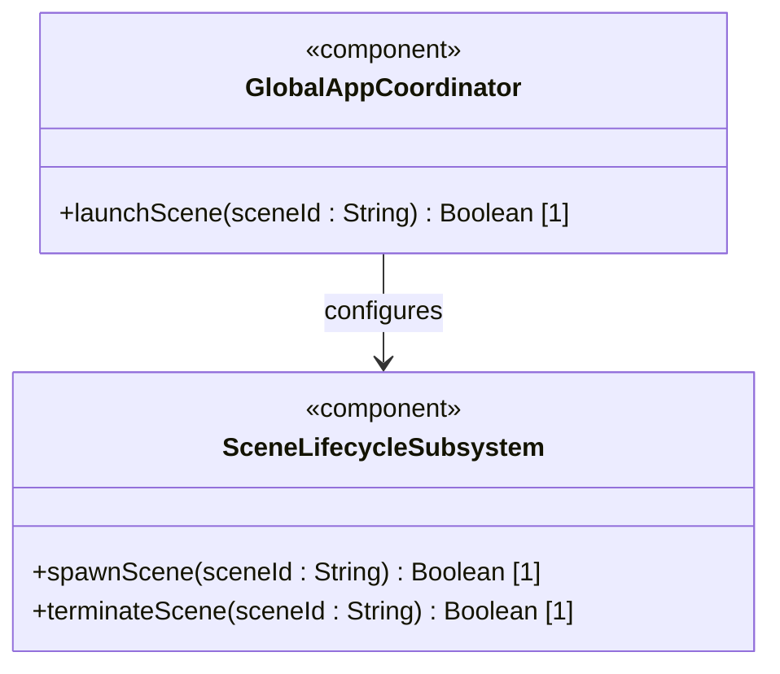
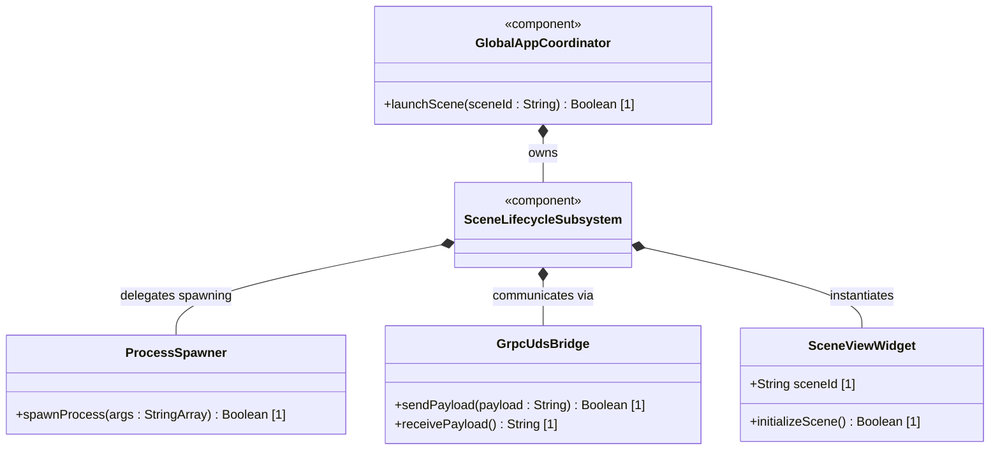
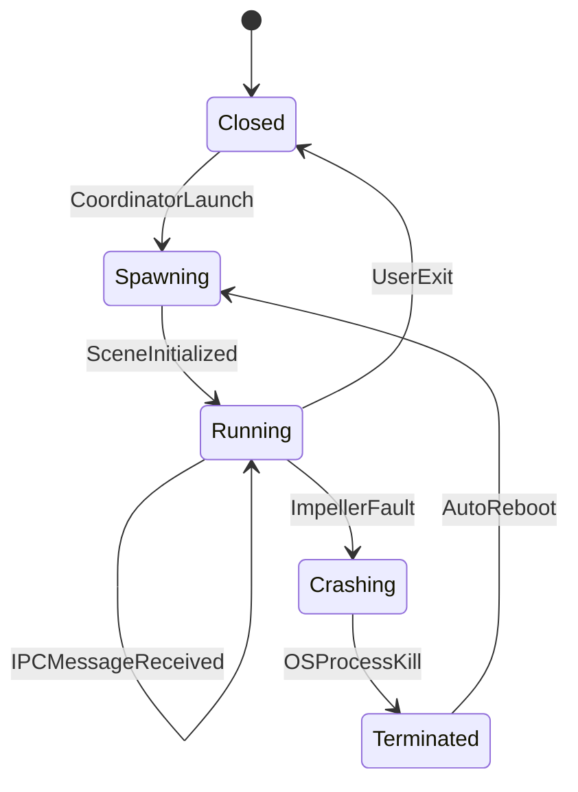

# Epic 2: Platform-Agnostic Scene-Based Lifecycle (Windowing) Epic

## 1. Context
This Epic governs the windowing and process lifecycle management of the 3DGS Phoenix visualization platform. To prevent graphics and rendering crashes (such as Impeller shader compilation errors or GPU driver lockups) from crashing the entire application, the platform segregates separate UI windows (scenes) into independent operating system processes. Each process hosts a dedicated Flutter engine instance and communicates with the host Global App Coordinator via gRPC Unix Domain Sockets (UDS). On macOS, these spawned scene engines are configured to run as background elements without cluttering the user's dock.

## 2. Requirements & Checklist
- [ ] #250 - [Feature 45: Isolated Scene Boot](https://github.com/gintatkinson/3dgs-phoenix/blob/main/docs/features/feat-45-isolated-scene-boot.md) (Isolated Scene Bootstrapping and multi-engine process execution)

### Associated Use Cases & User Stories

#### Associated Use Cases
None identified at this time.

#### Associated User Stories
- [ ] #256 - [CommandLine Scene Argument Routing](https://github.com/gintatkinson/3dgs-phoenix/blob/main/docs/user-stories/us-45-1-boot-args.md) (semantic linkage justification)
- [ ] #257 - [Fault-Segregated Scene Communication via UDS](https://github.com/gintatkinson/3dgs-phoenix/blob/main/docs/user-stories/us-45-2-grpc-uds.md) (semantic linkage justification)
- [ ] #258 - [macOS Dock Icon Supression Compliance](https://github.com/gintatkinson/3dgs-phoenix/blob/main/docs/user-stories/us-45-3-mac-dock.md) (semantic linkage justification)
None identified at this time.

## 3. Architecture

### Subsystem Component Definition

## System-Level UML Class Diagram

## System State Machine Diagram

## 4. Operational Considerations
Processes are spawned with command line arguments containing the target scene ID. Unix Domain Sockets must reside in the temporary folder designated by the operating system, with unique file naming conventions based on the process ID. Clean-up routines must delete socket files on exit.

## 5. Security & Governance
UDS sockets must restrict permissions to prevent cross-user interception. Process creation flags must deny shell execution capabilities on helper binaries. macOS helper applications must be code-signed.

## 6. Source References
Structural Schema: `docs/architecture/Architecture-spec-Cross-Platform-Rendering-and-WebAssembly.md`
Normative Specification: Project Constitution
