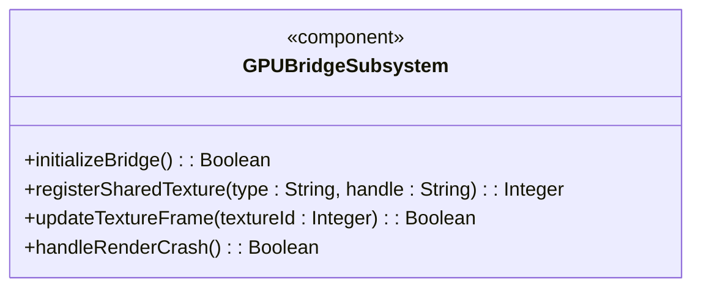
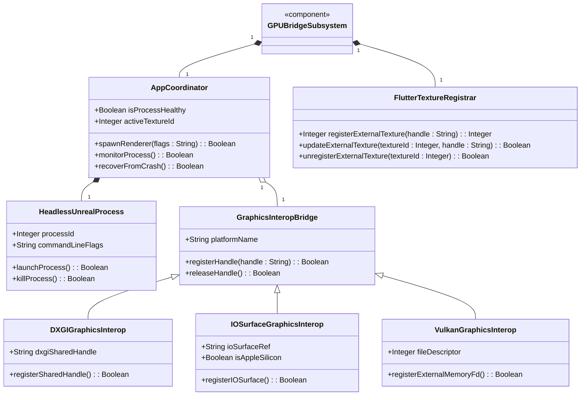
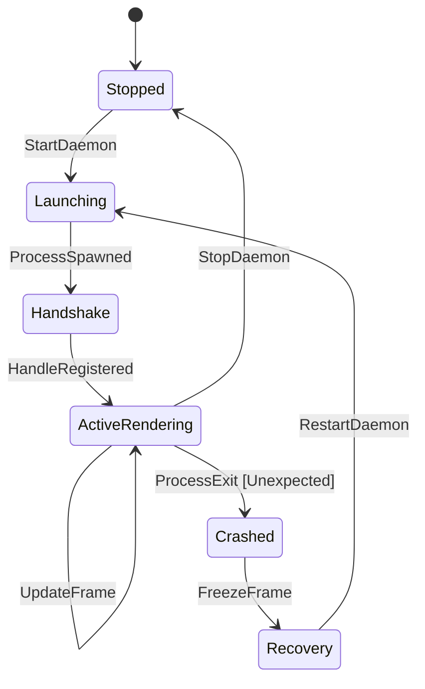

# Epic: Enterprise 3D Rendering (Zero-Copy GPU Texture Bridge)

## 1. Context
The Enterprise 3D Rendering (Zero-Copy GPU Texture Bridge) Epic defines the architectural framework and cross-platform native rendering interfaces required to share offscreen 3D rendering buffers from a headless Unreal Engine instance directly with the Flutter UI process. 

For high-fidelity enterprise 3D GIS visualization, copying rendering frames from GPU Video RAM (VRAM) to host memory (system RAM) and back to the GPU for compositing by Flutter's Impeller backend introduces unacceptable latency and CPU overhead, preventing the application from achieving 60 Frames Per Second (FPS). To eliminate this bottleneck, this epic formalizes a Zero-Copy GPU Interop Architecture. 

Under this architecture, the headless Unreal Engine process renders 3D graphics offscreen directly into a VRAM-backed buffer. It exports a platform-specific graphics memory handle (DXGI Shared Handle on Windows, IOSurfaceRef/CVPixelBuffer on macOS, or Vulkan External Memory File Descriptor on Linux) and transmits it over a local Inter-Process Communication (IPC) socket (Unix Domain Sockets or Named Pipes) to the Flutter Global App Coordinator. The Coordinator registers the graphics handle as an external texture. Flutter's rendering backend (Impeller) then samples directly from this shared texture in VRAM during the layout paint cycle.

```
+------------------------------------+             +--------------------------------------+
|       Flutter Host Process         |             |      Headless Unreal Engine Daemon   |
|                                    |             |                                      |
| +--------------------------------+ |             | +----------------------------------+ |
| |       SceneViewWidget          | |             | |       Cesium for Unreal          | |
| |                                | |             | |   (Renders 3D Photorealistic     | |
| |  +--------------------------+  | |             | |         Tilesets)                | |
| |  |  External VRAM Texture   |  | |             | +------------------+---------------+ |
| |  |  (Direct GPU Sample)     |  | |             |                    |                 |
| |  +-------------^------------+  | |             |                    | Offscreen Paint |
| +----------------|---------------+ |             |                    v                 |
|                  |                 |             | +----------------------------------+ |
|                  | (Samples VRAM)  |             | |       Offscreen Framebuffer      | |
|                  |                 |             | |      (GPU Backed VRAM Texture)   | |
| +----------------+---------------+ |             | +------------------+---------------+ |
| |    Impeller Renderer Backend   | |             |                    |                 |
| +----------------^---------------+ |             |                    | Export          |
|                  |                 |             |                    v                 |
|  ================|====================================================|===============  |
|                  |                   [ GPU VRAM BOUNDARY ]            |                 |
|                  |                                                    |                 |
|                  +------------------ Shared GPU Handle <--------------+                 |
|                               (DXGI Handle / IOSurfaceRef / Vulkan FD)                  |
|                                                                                         |
|  =====================================================================================  |
|                  ^                                                    |                 |
|                  |                   [ OS PROCESS IPC ]               |                 |
|                  |                                                    |                 |
|          gRPC over UDS <----------------------------------------------+                 |
|     (Camera sync, Handle exchange, Crash detection, Lifecycle signals)                  |
+-----------------------------------------------------------------------------------------+
```

## 2. Requirements & Checklist
- [ ] #251 - Feature 2.1: Headless Unreal Engine Orchestration (https://github.com/gintatkinson/3dgs-phoenix/blob/main/docs/features/feat-03-headless-unreal-orchestration.md) (Launches offscreen Unreal process via -RenderOffscreen flag and monitors its PID)
- [ ] #252 - Feature 2.2: Windows DXGI Interop (https://github.com/gintatkinson/3dgs-phoenix/blob/main/docs/features/feat-04-windows-dxgi-interop.md) (Maps Unreal DX12/Vulkan texture exports to kFlutterDesktopGpuSurfaceTypeDxgiSharedHandle)
- [ ] #253 - Feature 2.3: macOS IOSurface Interop (https://github.com/gintatkinson/3dgs-phoenix/blob/main/docs/features/feat-05-macos-iosurface-interop.md) (Integrates IOSurfaceRef with MTLStorageModeShared backing CVPixelBuffer on Apple Silicon)
- [ ] #254 - Feature 2.4: Linux Vulkan Interop (https://github.com/gintatkinson/3dgs-phoenix/blob/main/docs/features/feat-06-linux-vulkan-interop.md) (Exposes Vulkan textures using VK_KHR_external_memory_fd and sends FDs over UDS)

### Associated Use Cases & User Stories

#### Associated Use Cases
- [ ] #UC-3 - Handling an Unreal Engine Rendering Crash and seamless hot-swap (https://github.com/gintatkinson/3dgs-phoenix/blob/main/docs/use-cases/uc-03-rendering-crash-recovery.md) (Handles headless daemon crashes, freezes UI frame, and swaps new texture references dynamically)

##### Detailed Use Case: UC-3 (Handling Unreal Engine Rendering Crash)
* **Actors:** `Global App Coordinator` (Dart/Flutter), `Scene Delegates` (Dart/Flutter), `Headless Rendering Daemon` (C++/Unreal Engine)
* **Preconditions:** The headless Unreal process is running and actively sharing VRAM texture buffers with the Coordinator process.
* **Trigger:** A malformed Photorealistic 3D Tile from Cesium ion causes a segmentation fault or memory violation in the headless Unreal process, triggering a sudden process exit.
* **Main Success Scenario (Process Recovery and Texture Hot-Swap):**
  1. The headless Unreal process exits abruptly with a non-zero exit code.
  2. The `Global App Coordinator` detects the subprocess exit signal through its process monitoring loop.
  3. The `Scene Delegates` freeze the active Flutter `Texture` widget on the last valid frame, avoiding rendering artifacts or black screens.
  4. The `Global App Coordinator` logs the crash details, cleans up stale texture buffers, and spawns a fresh `Headless Rendering Daemon` process using the `-RenderOffscreen` flag.
  5. The new `Headless Rendering Daemon` boots up, registers itself with the coordinator via gRPC over UDS, and begins offscreen rendering.
  6. The daemon exports its initial frame as a platform-appropriate GPU handle (e.g. DXGI Shared Handle, IOSurfaceRef, or Vulkan FD) and transmits it to the coordinator.
  7. The coordinator imports the new handle and registers it as an external texture.
  8. The `Scene Delegates` hot-swap the texture pointer inside the active Flutter `Texture` widget to point to the new external texture ID.
  9. The viewport rendering loop resumes, displaying current frames seamlessly.
* **Postconditions:** Visual rendering is restored to the active viewport, and process telemetry statistics are updated.

#### Associated User Stories

##### User Story US-2.1: Headless Unreal Daemon Orchestration
* **As an** Application Coordinator,
* **I want to** spawn and monitor a headless Unreal Engine process using platform-appropriate flags,
* **So that** 3D Cesium visualization runs offscreen without showing a separate window or burdening the host OS window manager.
* **Given-When-Then Acceptance Criteria:**
  * **Scenario: Successful offscreen Unreal process initialization**
    * **Given** the Global App Coordinator has initialized,
    * **When** the coordinator boots the Unreal Engine subprocess,
    * **Then** it must include the `-RenderOffscreen` argument in the execution command,
    * **And** the process must start without exposing a native OS window,
    * **And** the coordinator must establish a gRPC Unix Domain Socket connection with the daemon.
  * **Scenario: Headless Unreal process health monitoring**
    * **Given** the headless Unreal process is running,
    * **When** the process unexpectedly exits with a non-zero code,
    * **Then** the coordinator must capture the exit signal and transition the viewport to a recovery state.

##### User Story US-2.2: Windows DXGI VRAM Sharing
* **As a** Windows Graphics Delegate,
* **I want to** share DirectX 12/Vulkan texture buffers from the offscreen Unreal daemon to Flutter via DXGI shared handles,
* **So that** Flutter can composit the 3D frame directly in VRAM without CPU-side copies.
* **Given-When-Then Acceptance Criteria:**
  * **Scenario: Registering a DXGI shared handle in Flutter**
    * **Given** a Windows host running the headless Unreal daemon,
    * **When** the Unreal process exports a rendered frame texture as a DXGI shared handle and sends the handle value to the Flutter host,
    * **Then** the Flutter Windows embedder must register the handle using the `kFlutterDesktopGpuSurfaceTypeDxgiSharedHandle` surface type,
    * **And** Flutter's Impeller backend must sample the texture directly from VRAM during the widget paint cycle.

##### User Story US-2.3: macOS IOSurface VRAM Sharing
* **As a** macOS Graphics Delegate,
* **I want to** share Metal textures from the offscreen Unreal daemon to Flutter using `CVPixelBuffer` backed by `IOSurfaceRef`,
* **So that** Flutter can render the offscreen frame with zero-copy efficiency on Apple Silicon.
* **Given-When-Then Acceptance Criteria:**
  * **Scenario: Initializing IOSurface sharing on macOS**
    * **Given** a macOS host running Apple Silicon,
    * **When** the offscreen daemon creates the shared backing texture buffer,
    * **Then** it must configure the `CVPixelBuffer` with an underlying `IOSurfaceRef`,
    * **And** the Metal texture storage mode must be set to `MTLStorageModeShared`,
    * **And** the Flutter macOS embedder must paint the UI by referencing the `IOSurfaceRef` direct texture representation.

##### User Story US-2.4: Linux Vulkan External Memory Sharing
* **As a** Linux Graphics Delegate,
* **I want to** export Vulkan memory handles as file descriptors from the Unreal process and import them into Flutter,
* **So that** the application achieves zero-copy rendering on Linux hosts.
* **Given-When-Then Acceptance Criteria:**
  * **Scenario: Vulkan external memory FD transfer**
    * **Given** a Linux host with a running headless Unreal process,
    * **When** the Unreal renderer allocates its output Vulkan image,
    * **Then** it must export the memory using the `VK_KHR_external_memory_fd` extension,
    * **And** the process must send the resulting file descriptor (fd) over the local Unix Domain Socket (UDS) bridge to the Flutter texture registrar.

##### User Story US-2.5: Rendering Crash Recovery and Hot-Swap
* **As an** Application Coordinator,
* **I want to** detect a crash of the offscreen Unreal process and seamlessly re-spawn the process and hot-swap its GPU handle,
* **So that** the user experience is preserved with minimal visual interruption.
* **Given-When-Then Acceptance Criteria:**
  * **Scenario: Detecting crash and freezing frame**
    * **Given** the 3D visualization is actively rendering,
    * **When** the headless Unreal process crashes (segfault or exit),
    * **Then** the coordinator must freeze the Flutter `Texture` widget on the last valid frame buffer,
    * **And** it must start a new instance of the headless Unreal process offscreen.
  * **Scenario: Seamless texture hot-swap after restart**
    * **Given** the coordinator has successfully re-spawned the Unreal process,
    * **When** the new process registers its new graphics shared handle (DXGI, IOSurface, or Vulkan FD),
    * **Then** the coordinator must dynamically swap the active texture handle pointer in the Flutter `Texture` widget,
    * **And** resume the rendering loop without requiring a restart of the main Flutter application.

## 3. Architecture and System Interaction Diagrams

### Subsystem Component Definition
The `GPUBridgeSubsystem` represents the subsystem coordinating the lifecycle of the headless Unreal engine process and importing its shared textures into the Flutter composition queue.


### System-Level UML Class Diagram


## 4. State Machine Definitions

### System State Machine Diagram
The state machine below defines the operational lifecycles of the zero-copy GPU texture bridge and the offscreen Unreal daemon process.


## 5. Specification Context
The following text is injected verbatim from the system's core architectural guidelines (`docs/architecture/Architecture-spec-Cross-Platform-Rendering-and-WebAssembly.md`):

```
### Epic 2: Enterprise 3D Rendering (Zero-Copy GPU Texture Bridge)

Context: For maximum visual fidelity, the system relies on an offscreen Unreal Engine instance streaming Cesium ion datasets. The rendered frames must be transferred to the Flutter UI without CPU memory copies.

* Requirement 2.1 (Headless Unreal Orchestration): The coordinator must spawn Unreal Engine using the -RenderOffscreen argument to bypass OS window managers.
* Requirement 2.2 (Windows DXGI Interop): On Windows, the Unreal DirectX 12/Vulkan output must be exported as a DXGI shared handle. Flutter must map this using kFlutterDesktopGpuSurfaceTypeDxgiSharedHandle to sample VRAM directly.
* Requirement 2.3 (macOS IOSurface Interop): On macOS, the engine must output to a CVPixelBuffer backed by an IOSurfaceRef. To support Apple Silicon, the buffer must be configured with MTLStorageModeShared.
* Requirement 2.4 (Linux Vulkan Interop): On Linux, the offscreen engine must expose memory via the VK_KHR_external_memory_fd extension, passing the file descriptor over the UDS bridge to the Flutter texture registrar.
```

The following use case context is also injected verbatim:

```
**UC-3: Handling an Unreal Engine Rendering Crash**

* Trigger: A malformed Photorealistic 3D Tile from Cesium ion causes a segmentation fault in the headless Unreal process.
* Action: The Flutter Texture widget freezes on the last valid GPU frame. The Coordinator detects the child process exit code.
* Outcome: The Coordinator logs the error, reboots the Unreal Engine daemon, requests a fresh DXGI/IOSurface handle, and hot-swaps the new memory address into the active Flutter Texture widget seamlessly.
```

## 6. Source References
Structural Schema: `app_flutter/assets/logical-layout.json`
Normative Specification: [Architecture-spec-Cross-Platform-Rendering-and-WebAssembly.md](file:///Users/perkunas/jail/3dgs-phoenix/docs/architecture/Architecture-spec-Cross-Platform-Rendering-and-WebAssembly.md)
