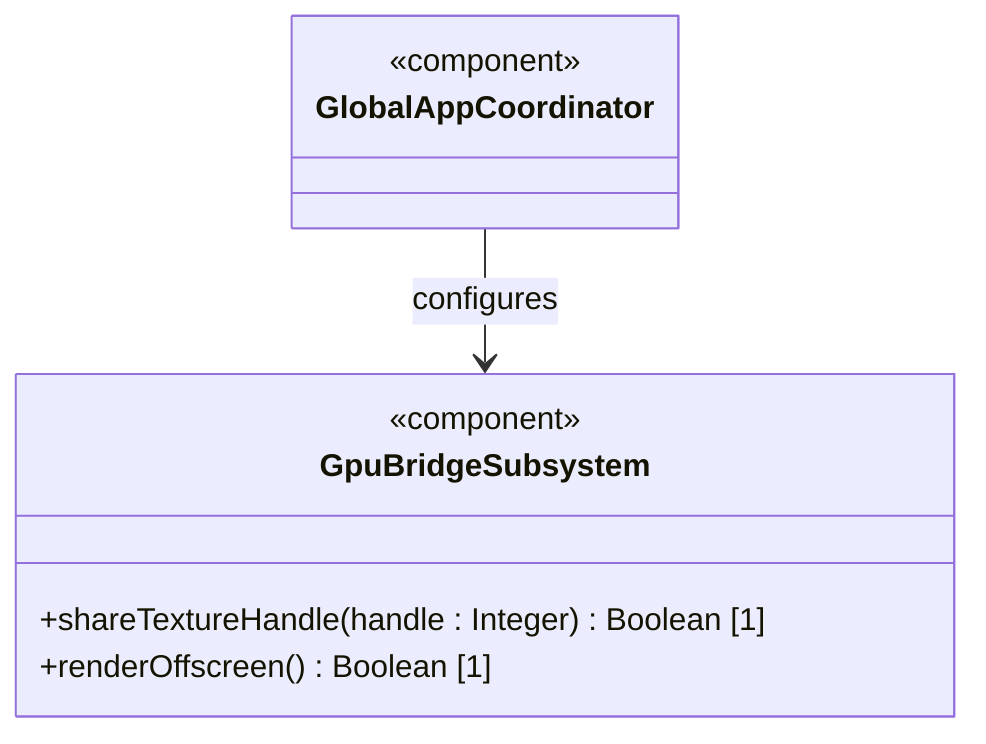
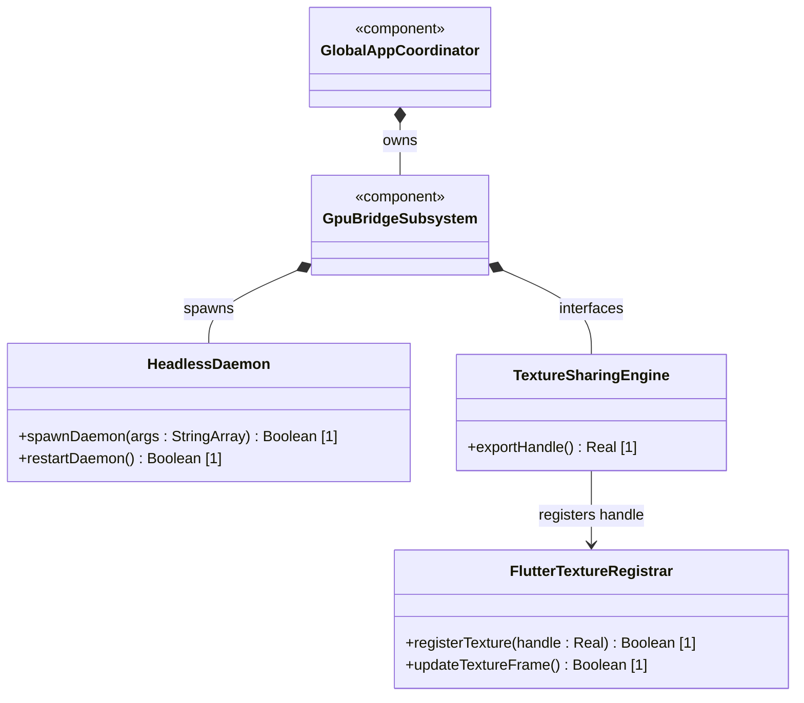
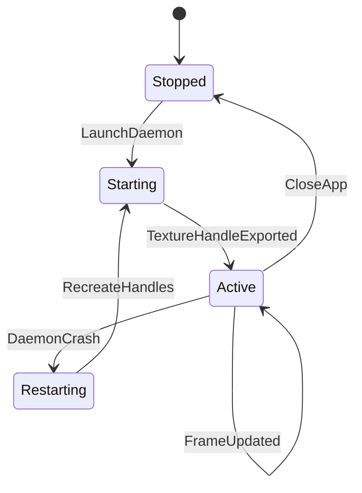

# Epic 3: Enterprise 3D Rendering (Zero-Copy GPU Texture Bridge)

## 1. Context
This Epic governs the zero-copy, hardware-accelerated 3D graphics texture bridge interfacing an offscreen Unreal Engine instance streaming Cesium ion datasets with the host Flutter UI. To achieve stable 60 FPS rendering rates, frames rendered by the Unreal Engine instance must bypass CPU memory copies entirely. The system achieves this by exporting native GPU memory handles (DXGI shared handles on Windows, IOSurfaces on macOS, and Vulkan external memory file descriptors on Linux) and registering them with Flutter's low-level texture registry.

## 2. Requirements & Checklist
- [ ] #251 - [Feature 46: Headless Unreal Daemon Orchestration](https://github.com/gintatkinson/3dgs-phoenix/blob/main/docs/features/feat-46-headless-orchestration.md) (Headless Unreal process management and orchestration)
- [ ] #252 - [Feature 47: Windows DXGI Texture Interop](https://github.com/gintatkinson/3dgs-phoenix/blob/main/docs/features/feat-47-windows-dxgi-interop.md) (Windows DXGI texture interop)
- [ ] #253 - [Feature 48: macOS IOSurface Texture Interop](https://github.com/gintatkinson/3dgs-phoenix/blob/main/docs/features/feat-48-macos-iosurface-interop.md) (macOS IOSurface texture interop)
- [ ] #254 - [Feature 49: Linux Vulkan External Memory Interop](https://github.com/gintatkinson/3dgs-phoenix/blob/main/docs/features/feat-49-linux-vulkan-interop.md) (Linux Vulkan external memory interop)

### Associated Use Cases & User Stories

#### Associated Use Cases
None identified at this time.

#### Associated User Stories
None identified at this time.

## 3. Architecture

### Subsystem Component Definition

## System-Level UML Class Diagram

## System State Machine Diagram

## 4. Operational Considerations
The offscreen Unreal process must run headless without displaying a window frame to the user. Dynamic recovery is required: if the offscreen process crashes, the texture widget must freeze on the last valid frame, reboot the daemon, request a new handle, and seamlessly resume streaming.

## 5. Security & Governance
GPU handles must only be accessible within the parent-child process tree. Vulkan file descriptors shared via UDS must verify the client process credentials. macOS IOSurfaces must not be globally readable.

## 6. Source References
Structural Schema: `docs/architecture/Architecture-spec-Cross-Platform-Rendering-and-WebAssembly.md`
Normative Specification: Project Constitution
