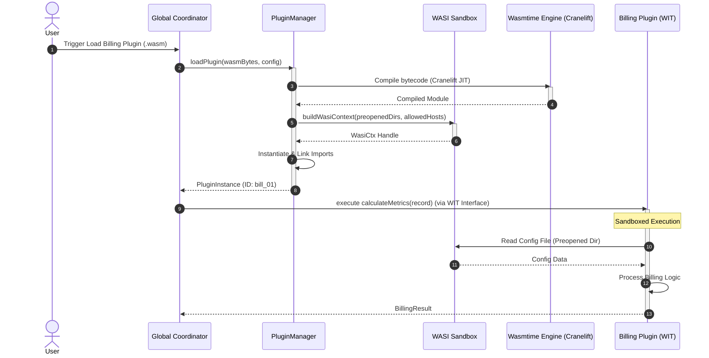
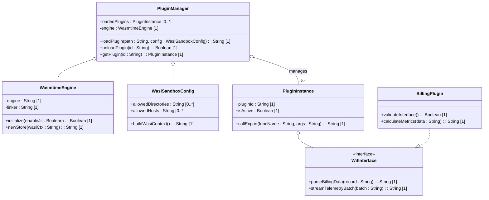
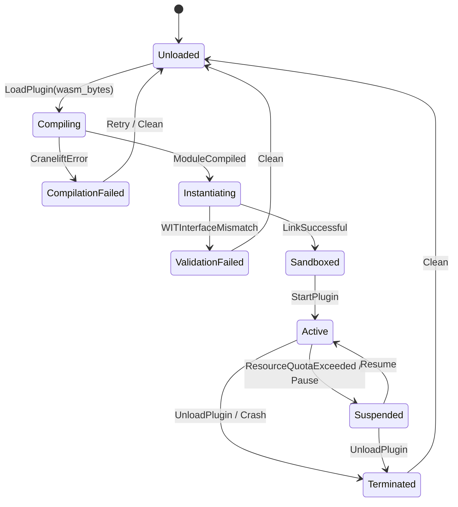

# Epic: WebAssembly Component Model Extensibility

## 1. Context
To support third-party extensibility, custom network protocol parsers, and external billing integrations safely, the platform embeds a WebAssembly execution environment. The Global Coordinator embeds the Rust `wasmtime` runtime to execute sandboxed `.wasm` plugins. 

Rather than relying on legacy, unsafe shared libraries (`.dll`, `.dylib`, `.so`) or heavy subprocess overhead, the architecture utilizes the WebAssembly Component Model (WASI and WIT). 
- **Near-Native Execution**: The Wasmtime engine compiles Wasm bytecode directly into host machine instructions using the Cranelift JIT compiler.
- **Capability-Based Sandboxing**: Wasm plugins execute within a strictly constrained WASI environment. File system and network capabilities are not implicitly inherited from the host process. Access to specific directories or network sockets must be explicitly mapped and pre-opened during instantiation.
- **WIT Interfaces**: Instead of raw, low-level integer/pointer passing across the Foreign Function Interface (FFI) boundary, WebAssembly Interface Types (WIT) specify high-level types (records, variants, lists, results). The `wit-bindgen` tool generates standard, type-safe bindings for the Rust plugins and the host runtime.
- **Asynchronous Batching**: FFI transitions introduce overhead. To ensure 60 FPS UI rendering and coordinate streams are not blocked by high-frequency plugin communications, commands are batched in memory on both sides of the boundary before crossing.

---

## 2. Requirements & Checklist

### Associated Use Cases & User Stories

#### Use Case UC-2: Loading a Third-Party Billing Plugin

- **Actor**: Global Coordinator / User
- **Trigger**: User installs a compiled `.wasm` extension representing a billing plugin.
- **Preconditions**:
  1. The `.wasm` module conforms to the pre-defined WIT interface structure.
  2. The Global Coordinator has initialized the `WasmtimeEngine` with Cranelift JIT.
- **Main Success Scenario**:
  1. The user requests the system to load the billing plugin from a specific directory.
  2. The `PluginManager` reads the plugin bytes and invokes the Cranelift compiler.
  3. The runtime builds a `WasiCtx` containing restricted directory permissions (e.g. read-only access to a specific local configuration folder) and denies network access.
  4. The runtime instantiates the compiled module, linking the imports via the WIT interface.
  5. The plugin is registered and activated.
  6. The Coordinator invokes `calculateMetrics` through the FFI boundary, passing structured billing logs.
  7. The plugin processes the logs and writes temporary reports inside the sandboxed directory.
  8. The plugin returns the calculated metrics to the Coordinator via a structured WIT response.
- **Postconditions**:
  1. The billing plugin remains loaded and sandboxed.
  2. The plugin has zero access to host environment variables or directories outside the designated sandbox.
  3. The host process remains isolated from any plugin memory safety issues.

#### User Stories

##### US-4.1.1: Runtime initialization with Cranelift JIT
**As an** Application Administrator,  
**I want** the host process to initialize the Wasmtime JIT compiler,  
**So that** loaded WebAssembly modules can run at near-native execution speeds.

* **Requirement Reference**: Requirement 4.1
* **Acceptance Criteria**:
  * **Given** the Global App Coordinator is starting up,
  * **When** the `WasmtimeEngine` is instantiated,
  * **Then** the engine's configuration must have `cranelift` enabled as the compiler and JIT optimization level set to `speed`.
  * **And** loading a standard benchmark `.wasm` file must return a compiled executable module with a compilation latency of less than 150ms.

##### US-4.2.1: WASI filesystem capability constraint
**As a** Security Officer,  
**I want** third-party plugins to access only pre-approved folders on the host filesystem,  
**So that** plugins cannot read sensitive user documents or write malicious system files.

* **Requirement Reference**: Requirement 4.2
* **Acceptance Criteria**:
  * **Given** a WASM plugin has been configured with access to `/Users/perkunas/jail/3dgs-phoenix/app_flutter/assets/` as a pre-opened directory,
  * **When** the plugin executes a file-read command inside that path,
  * **Then** it must succeed and return the correct file content.
  * **When** the plugin attempts to open or write to `/etc/passwd` or `/Users/perkunas/.ssh`,
  * **Then** the WASI capability checks must reject the call, and the operation must fail with a `PermissionDenied` error.

##### US-4.2.2: WASI network capability isolation
**As a** Network Security Engineer,  
**I want** plugins to be restricted from making unauthorized network calls,  
**So that** proprietary billing or telemetry data is not leaked to external servers.

* **Requirement Reference**: Requirement 4.2
* **Acceptance Criteria**:
  * **Given** a plugin is initialized with network capabilities explicitly disabled in the `WasiSandboxConfig`,
  * **When** the plugin attempts to resolve an IP address or open a socket connection,
  * **Then** the runtime must intercept and terminate the operation, throwing a `SocketException` or sandbox violation.

##### US-4.3.1: WIT Bindgen data streaming type validation
**As a** Rust Plugin Developer,  
**I want** to specify plugin interfaces using WebAssembly Interface Types (WIT) and compile them with `wit-bindgen`,  
**So that** complex data models can be passed to and from the host without writing manual pointer/offset conversion code.

* **Requirement Reference**: Requirement 4.3
* **Acceptance Criteria**:
  * **Given** a WIT interface declaration defining a `record BillingRecord { id: string, amount: float64 }` and a `result<BillingResult, Error>` return type,
  * **When** the Rust plugin is compiled using the `wit-bindgen` macro,
  * **Then** the generated code must compile without errors.
  * **And** when the host passes a `BillingRecord` instance across the FFI boundary, the target fields must match precisely on the Rust side without manual memory allocations.

##### US-4.4.1: Asynchronous FFI batching queue execution
**As a** Core Performance Engineer,  
**I want** high-frequency plugin events to be batched and dispatched asynchronously,  
**So that** the FFI boundary crossing overhead does not block the 60 FPS UI rendering thread.

* **Requirement Reference**: Requirement 4.4
* **Acceptance Criteria**:
  * **Given** the application UI is rendering at 60 FPS and generating 200 telemetry updates per second,
  * **When** these telemetry events are sent to the Wasm subsystem,
  * **Then** the `PluginManager` must queue them in memory and dispatch them in batches (maximum frequency of 60 batch transfers per second).
  * **And** the average duration of the FFI call transition block must remain under 1ms, preserving the 16.6ms frame budget.

---

## 3. Architecture

### Subsystem Component Definition
The `WasmExtensibilitySubsystem` component defines the interfaces exposed to the coordinator and required from the plugins.
- **WasmExtensibilitySubsystem** (Component)
  - `loadPlugin(wasmBytes : ByteArray, config : SandboxConfig) : PluginInstance [1]`
  - `executeCommand(pluginId : String, payload : String) : String [1]`
- **PluginInstance**
  - Attributes:
    - `pluginId : String [1]`
    - `isActive : Boolean [1]`
  - Methods:
    - `callExport(funcName : String, args : String) : String [1]`

### System Interaction Diagram (Use Case UC-2)
The sequence of events when loading and executing a third-party billing plugin.

---

## 4. Operational Considerations
This section details the operational policies for the WebAssembly subsystem.
- **Plugin Initialization**: Plugins are dynamically loaded and compiled using the Cranelift JIT compiler upon request, ensuring minimal startup latency.
- **Instance Lifecycle**: Plugin instances transition through loaded, active, suspended, and terminated states managed by the host runtime.
- **Host Resource Protection**: Resource quotas are enforced via store limits on execution fuel and memory allocation to prevent resource exhaustion attacks.

---

## 5. Security & Governance
This section details the security model protecting the host system from untrusted guest code.
- **WASI Filesystem Sandbox**: Plugins execute in an isolated directory space, only accessing pre-opened paths explicitly mapped at instantiation.
- **Denied Capabilities**: Raw network access, system clock adjustments, environment variables, and process execution are denied by default.
- **Memory Boundaries**: Linear memory allocation ensures guest plugins cannot access or corrupt host memory spaces.

---

## 6. Source References
- Architectural Specification: [Architecture-spec-Cross-Platform-Rendering-and-WebAssembly.md](file:///Users/perkunas/jail/3dgs-phoenix/docs/architecture/Architecture-spec-Cross-Platform-Rendering-and-WebAssembly.md)
- Wasmtime Rust Config Reference: [wasmtime::Config docs](https://docs.wasmtime.dev/api/wasmtime/struct.Config.html)
- WebAssembly Component Model WIT Specs: [WIT By Example](https://component-model.bytecodealliance.org/design/wit-example.html)
- WASI Capability Design Principles: [WASM System Interface](https://wasi.dev/)

---

## System-Level UML Class Diagram

---

## System State Machine Diagram

The state transition model for Wasm plugins loaded within the host runtime.

