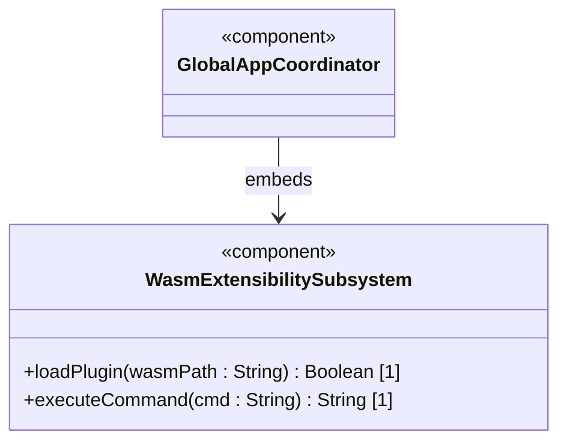
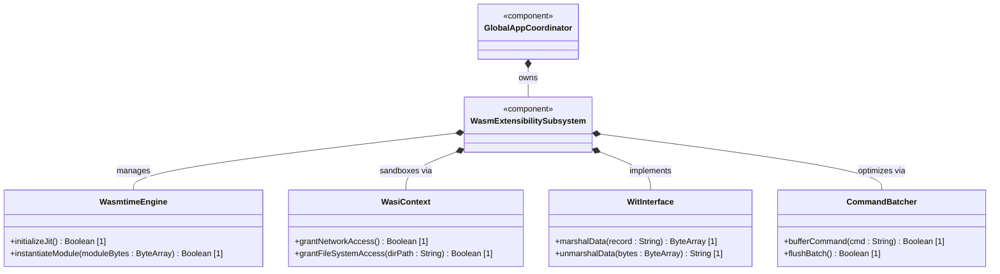
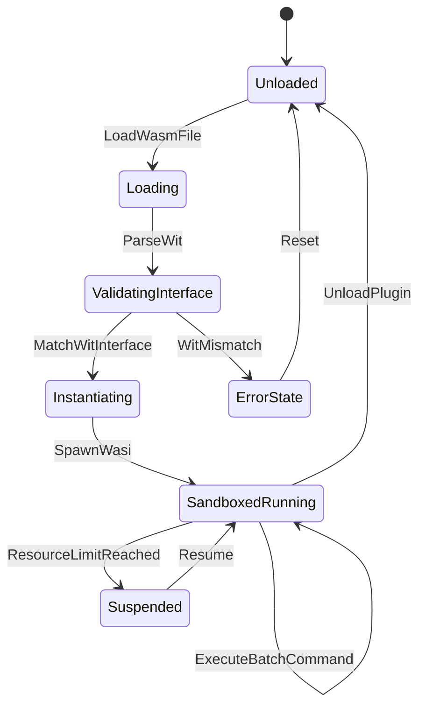

# Epic 4: WebAssembly Component Model Extensibility Epic

## 1. Context
This Epic governs the sandboxed execution subsystem of the 3DGS Phoenix platform. To support custom business logic (e.g., protocol decoding, data conversions, or custom billing calculations) developed by third parties without compromising host OS safety, the platform embeds a WebAssembly (Wasm) runtime using the Wasmtime engine. Plugins execute in a strictly isolated WASI context (restricting filesystem and network access). Communication uses WebAssembly Interface Types (WIT) to handle complex data structures efficiently, and calls are batched to avoid JIT-to-native execution bottlenecks during high-frequency render loops.

## 2. Requirements & Checklist
- [ ] #255 - [Feature 50: Wasm Extensibility Subsystem](https://github.com/gintatkinson/3dgs-phoenix/blob/main/docs/features/feat-50-wasm-extensibility.md) (Sandboxed Wasm execution engine and WIT component model bindings)

### Associated Use Cases & User Stories

#### Associated Use Cases
None identified at this time.

#### Associated User Stories
None identified at this time.

## 3. Architecture

### Subsystem Component Definition

## System-Level UML Class Diagram

## System State Machine Diagram

## 4. Operational Considerations
To maintain high frame rates, JIT compilation of `.wasm` modules is performed asynchronously during startup or installation. Plugins are cached in their compiled format to speed up subsequent load times. Memory utilization must be capped per sandbox to prevent out-of-memory errors on the host.

## 5. Security & Governance
The WASI environment must explicitly deny raw socket creation and folder mapping outside the designated application directories. The Cranelift JIT engine must disable unsafe WASM features.

## 6. Source References
Structural Schema: `docs/architecture/Architecture-spec-Cross-Platform-Rendering-and-WebAssembly.md`
Normative Specification: Project Constitution
