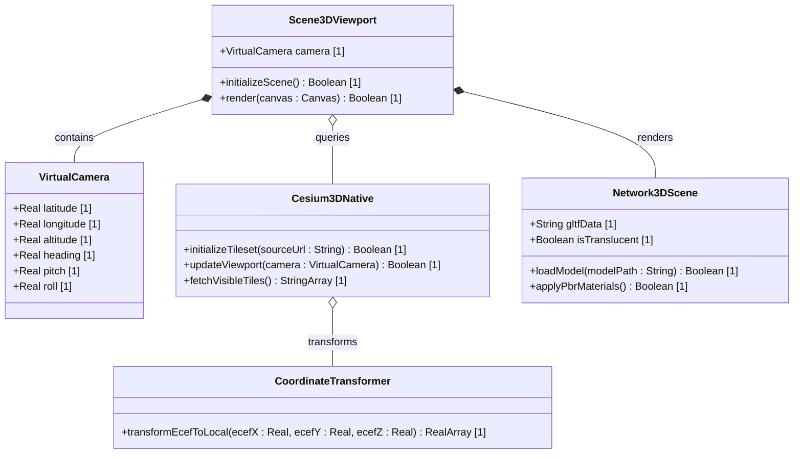

# Feature: Native Desktop 3D Network Visualization

## Parent Epic
- [ ] #[EpicID] - 3D Visualization Epic (https://github.com/gintatkinson/3dgs-002/blob/main/docs/epics/epic-01-3d-visualization.md) (Aggregates high-performance native rendering pipelines)

## Description
Establishes a native, single-process desktop 3D network topology visualization by interfacing the C++ spatial logic library `cesium-native` (via Dart FFI) with Flutter's low-level `flutter_gpu` and high-level `flutter_scene` libraries. This setup enables rendering global-scale photorealistic tilesets and logical microwave line-of-sight (LoS) links directly in the Flutter viewport without embedded webviews or multi-process sharing mechanisms.

## UML Class Diagram


## Interface Requirements
### 1. Test Data Shape
```json
{
  "camera": {
    "latitude": 37.7749,
    "longitude": -122.4194,
    "altitude": 500.0,
    "heading": 0.0,
    "pitch": -45.0,
    "roll": 0.0
  },
  "tileset_source": "https://assets.ion.cesium.com/12345/tileset.json",
  "loaded_gltf_models": [
    {
      "id": "node-101",
      "ecef_coordinates": [
        -2700501.2,
        -4292514.8,
        3856230.1
      ],
      "model_uri": "models/tower_high_density.gltf"
    }
  ]
}
```

### 2. Validation & Constraints
- **Latitude Boundary:** Must be in the range `[-90.0, 90.0]`.
- **Longitude Boundary:** Must be in the range `[-180.0, 180.0]`.
- **Altitude Boundary:** Must be greater than or equal to `-100.0` meters (minimum terrain base).
- **Coordinate Matrix Check:** ECEF coordinates transformed across the FFI boundary must map to real values (`NaN` or `Infinite` coordinates are rejected).

### 3. Visual Layout & Arrangement
- **Component Layout:** Employs the `TopographicalView` widget class mounted within the `topology_pane` layout partition.
- **CSS Specificity Reset:** Layout components must encapsulate child containers using explicit CSS container sizes (`contain: layout paint;` on the outer layout splitter widget) and prevent nested reflow state losses during split-pane drags.
- **FFI Boundary Loop:** 
  1. The widget tree captures user camera gestures.
  2. Updates are passed via FFI to `cesium_3d_native` spatial culling loop.
  3. Culled glTF tiles are compiled via Dart native-assets and loaded directly into GPU VRAM using `flutter_scene`.

### 4. Interactive Flow & States
- **Impeller Graphics Error:** If the desktop application is launched without the `--enable-impeller` flag on desktop platforms, the application must crash-restart or display a fallback visual warning.
- **GLSL Shader Compile Failure:** If PBR or custom compute shaders fail to compile, the scene falls back to simple unshaded flat geometry and raises a validation flag.

## Given-When-Then Acceptance Criteria
- **Scenario 1: Camera coordinate updates trigger FFI spatial culling**
  - **Given** the 3D viewport is initialized with a photorealistic tileset URL.
  - **When** the virtual camera is moved to latitude `37.7749`, longitude `-122.4194`.
  - **Then** the FFI boundary fetches the visible glTF tile payload and transforms its ECEF coordinates into local scene coordinates.
- **Scenario 2: Boundary check for invalid camera altitude**
  - **Given** the 3D viewport is actively rendering.
  - **When** the camera altitude drops below `-100.0` meters.
  - **Then** the system throws a coordinate validation exception and clamps the camera height.
- **Scenario 3: Impeller graphics preview check**
  - **Given** the desktop application launches.
  - **When** the graphics driver detects Impeller is disabled.
  - **Then** the application alerts the user that `--enable-impeller` is required.
- **Scenario 4: Level of detail (SSE) and culling consistency near the horizon**
  - **Given** the 3D viewport is rendering a globe at a camera altitude h.
  - **When** the camera view renders tiles extending to the horizon boundary.
  - **Then** the visible tile finder must dynamically request a grid range (dx, dy) of tiles spanning the horizon angle theta = acos(R / (R + h)), and the renderer must not cull any mesh triangles where at least one vertex lies in the front hemisphere (z >= 0.0).

## 4. Source References
Structural Schema: `app_flutter/assets/logical-layout.json`
Normative Specification: [Architectural Blueprint: Native Desktop 3D Network Visualization with Flutter and Cesium]

## 5. Logical UI & Layout Bindings
- **Target LUI Component:** TopographicalView
- **Target Layout Container ID:** topology_pane
- **Data Source Bindings:** token:layout.data_sources.topology
