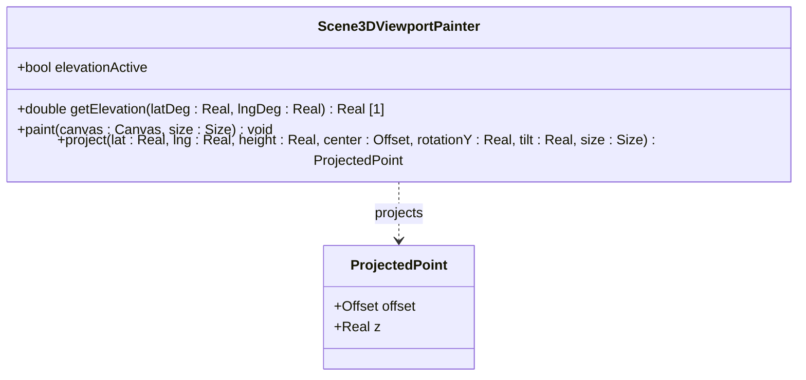

# Feature 02: 3D Terrain Elevation and Node Altitude Modeling (Issue #245)

## Parent Epic
- [ ] #243 - Epic 2: 3D Visualization Epic (https://github.com/gintatkinson/3dgs-phoenix/blob/main/docs/epics/epic-02-3d-visualization.md)

## Description
Enables dynamic 3D terrain elevation and ground node altitude modeling in the 3D viewport. When the `3D SURFACE ELEVATION` toggle is active, the viewport painter dynamically offsets terrain mesh vertices using a procedural elevation model (including Mount Fuji and the Japanese Alps) scaled with an amplification factor (80.0x) to ensure prominent visibility. Ground devices/buildings are positioned on top of this elevated terrain, with their local heights amplified (2000.0x) to stand tall above the topography, and drop lines terminate at the elevated terrain surface.

## UML Class Diagram

## Given-When-Then Acceptance Criteria

- **Scenario 1: Terrain elevation toggle active projects 3D mountains**
  - **Given** the 3D viewport is rendering with `3D SURFACE ELEVATION` active.
  - **When** tile mesh vertices at Mount Fuji (`35.3606° N, 138.7274° E`) are projected.
  - **Then** the projection engine applies the amplified elevation offset ($H = R + 3776 \times 80.0$).

- **Scenario 2: Ground nodes positioned dynamically on top of elevated terrain**
  - **Given** a ground node at Mount Fuji with a local building height of `50` meters.
  - **When** the node is projected under active 3D elevation.
  - **Then** its ECEF position uses the combined terrain and amplified building height ($H = R + H_{terrain} \times 80.0 + 50 \times 2000.0$).

- **Scenario 3: Drop lines terminate at elevated terrain surface**
  - **Given** a satellite node dropping a vertical line to a ground coordinate.
  - **When** 3D surface elevation is active.
  - **Then** the drop line terminates exactly at the local amplified terrain height ($H = R + H_{terrain} \times 80.0$).

- **Scenario 4: Terrain elevation toggle inactive renders flat ellipsoid**
  - **Given** the 3D viewport is rendering with `3D SURFACE ELEVATION` inactive.
  - **When** the terrain tiles and ground nodes are projected.
  - **Then** the elevation offsets are bypassed, and all heights are projected directly on the flat ellipsoid ($H = R$).

## 5. Logical UI & Layout Bindings
- **Target LUI Component:** TopographicalView
- **Target Layout Container ID:** topology_pane
- **Data Source Bindings:** token:layout.data_sources.topology
