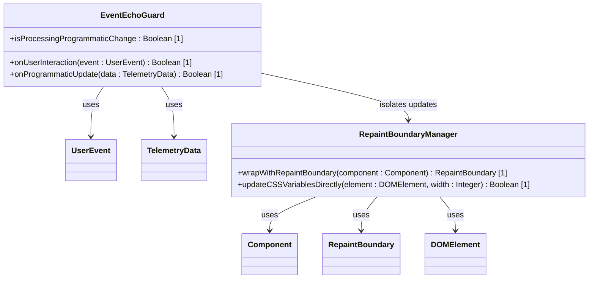

# Feature: Event-Echo Guard and Reflow Isolation

## Parent Epic
- [ ] #[EpicID] - [Epic Title](https://github.com/gintatkinson/digital-pipeline-repo/blob/master/docs/epics/epic-XX-name.md) (semantic linkage justification)

## Description
Details the AST check rules preventing infinite rendering loop triggers and the CSS/Impeller repaint boundaries to isolate reflow events.

## UML Class Diagram


## Interface Requirements
### 1. Test Data Shape
For DOM operations updating CSS layouts directly without triggering component re-renders:
```json
{
  "layoutUpdate": {
    "targetElementId": "resizable-pane-splitter",
    "cssVariables": {
      "--pane-width-ratio": "0.45"
    }
  }
}
```

### 3. Visual Layout & Arrangement
1. Bi-directional components initialize (e.g. TopologyMap and HierarchyTree).
2. The user interacts with a widget, triggering a user-hardware event (`onSelect` or `onChange`).
3. The EventEchoGuard flags the event source as user-originated, enabling propagation to other components.
4. If a component receives a programmatic state update (from telemetry or linked sync), it sets `isProcessingProgrammaticChange` to true.
5. While `isProcessingProgrammaticChange` is active, any secondary output event trigger or callback is blocked, breaking the circular rendering storm loop.
6. Repaint boundaries isolate dragging and resizing reflow operations (via CSS custom variables in web, or `RepaintBoundary` in Flutter) so the full layout tree is not repainted.

### 4. Interactive Flow & States
1. Circular Loop Detected: If the same event propagates back to the originating component within the same lifecycle frame, an AST lint check or runtime warning halts the execution trace to prevent browser freezing.
2. Reflow Budget Overrun: If a resize event triggers full page repaint, layout diagnostics flag performance degradation.
