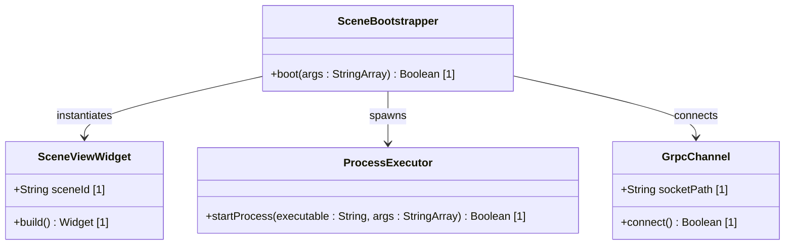

# Feature 45: Isolated Scene Boot

## Parent Epic
- [ ] #247 - [Epic 1: Platform-Agnostic Scene-Based Lifecycle (Windowing) Epic](https://github.com/gintatkinson/3dgs-phoenix/blob/main/docs/epics/epic-01-scene-lifecycle.md) (Aggregates multi-process windowing logic)

## Description
This feature provides isolated process spawning and command-line routing for standalone window views. At startup, the app parses main command-line arguments. If `--scene=[id]` is detected, it skips loading the default dashboard shell and boots into an isolated `SceneViewWidget` container. Communications between the coordinator process and scene engines use gRPC over Unix Domain Sockets (UDS) for complete fault segregation. On macOS, these scene processes are launched as helper apps with the `LSUIElement` key set to true to prevent dock icon clutter.

## UML Class Diagram


## Interface Requirements

### 1. Test Data Shape
```json
{
  "commandLineArgs": ["--scene=3d_viewer", "--target_id=ring_01"],
  "grpcConfig": {
    "socketPath": "/tmp/phoenix_uds_ring_01.sock",
    "timeoutMs": 5000
  },
  "osPlatform": "macos"
}
```

### 2. Validation & Constraints
- The `--scene` parameter must be parsed cleanly from the command line array.
- Socket path must not contain space characters and must reside in a writable temporary directory.
- If `--scene` is not supplied, the app must boot default `MainShell`.

### 3. Visual Layout & Arrangement
- The isolated scene window contains only the `TopographicalView` widget filling the entire screen.
- Layout resets apply: the outer panel uses explicit size containment `contain: layout paint;` to prevent Impeller recalculation lag.

### 4. Interactive Flow & States
- **Loading State:** Display spinner while the UDS socket link is being established.
- **Active State:** Mount the topology viewport upon successful gRPC connection.
- **Fault State:** If the coordinator terminates or the socket drops, display a persistent "Connection Lost" warning banner and freeze the scene.

## Given-When-Then Acceptance Criteria
- **Scenario 1: Command line parsing boots scene widget**
  - **Given** the app parses command line arguments `["--scene=3d_viewer"]`
  - **When** the startup bootstrap sequence completes
  - **Then** it mounts the `SceneViewWidget` as the root view.
- **Scenario 2: Launching macOS scene helper without Dock icon**
  - **Given** the app runs on macOS
  - **When** the process spawner starts a scene process
  - **Then** the target bundle runs as a helper element with `LSUIElement` key enabled, preventing a Dock icon.
- **Scenario 3: Crash isolation ensures coordinator survival**
  - **Given** the coordinator and two scene processes are running
  - **When** scene process A crashes due to a GPU crash
  - **Then** the coordinator and scene process B continue running unaffected.

## Specification Context (Verbatim)
- **Requirement 1.1:** The Global App Coordinator must parse command-line arguments main(List<String> args) to dictate engine behavior. If --scene=[id] is passed, the engine boots into a highly isolated SceneViewWidget() lifecycle.
- **Requirement 1.2:** Scenes must communicate with the Coordinator via local gRPC Unix Domain Sockets (UDS). If an Impeller shader faults in Scene A, the OS-level isolation must guarantee the Coordinator and Scene B remain active.
- **Requirement 1.3:** On macOS, isolated scene processes must be launched as helper apps with the LSUIElement key set to true in their Info.plist to prevent redundant Dock icons.

## 4. Source References
Structural Schema: `docs/architecture/Architecture-spec-Cross-Platform-Rendering-and-WebAssembly.md`
Normative Specification: Project Constitution

## 5. Logical UI & Layout Bindings
- **Target LUI Component:** TopologyMap
- **Target Layout Container ID:** topology_pane
- **Data Source Bindings:** token:layout.data_sources.topology
