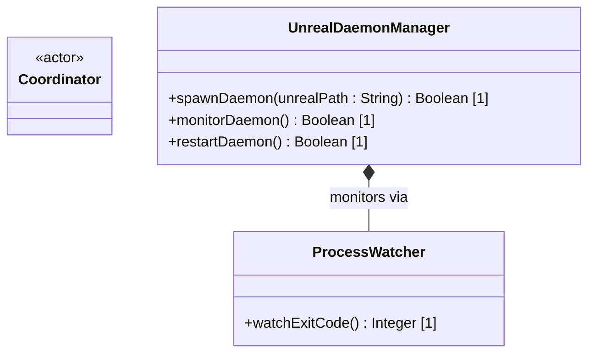

# Feature 46: Headless Unreal Daemon Orchestration (Issue #251)

## Parent Epic
- [ ] #248 - [Epic 3: Enterprise 3D Rendering (Zero-Copy GPU Texture Bridge)](https://github.com/gintatkinson/3dgs-phoenix/blob/main/docs/epics/epic-03-gpu-bridge.md) (Provides zero-copy texture sharing and headless renderer orchestration)

## Description
This feature provides the host process orchestration layer for spawning, monitoring, and restarting the offscreen Unreal Engine rendering daemon. The daemon is launched using the `-RenderOffscreen` flag to bypass native OS window managers. The manager captures daemon exit codes and handles automatic restart and hot-swapping of texture handles if a crash occurs.

## UML Class Diagram


## Interface Requirements

### 1. Payload Schema
```json
{
  "daemonPath": "/bin/unreal_headless",
  "args": ["-RenderOffscreen", "-graphicsapi=dx12"],
  "restartThreshold": 3
}
```

### 2. Validation & Constraints
- The daemon executable path must point to a valid executable on the host system.
- Executable arguments list must contain `-RenderOffscreen`.

### 3. Logical Operations & Interface Messages
- `spawnDaemon(unrealPath : String) : Boolean`: Launches the headless Unreal Engine background process.
- `monitorDaemon() : Boolean`: Registers process watchers to listen for exit signals.
- `restartDaemon() : Boolean`: Triggers teardown and respawn sequence, updating the active texture.

### 4. Logical Exception States & Validation Failures
- **DaemonBootFailure:** Raised if the executable path does not exist or fails to execute.
- **MaxRebootThresholdReached:** Raised if the daemon crashes more than the configured `restartThreshold` times within a 60-second window, halting auto-reboot to avoid CPU thrashing.

## Given-When-Then Acceptance Criteria
- **Scenario 1: Launch offscreen Unreal engine process**
  - **Given** the coordinator is configured to launch the offscreen renderer
  - **When** the bootstrap triggers process spawning
  - **Then** the process is spawned with the `-RenderOffscreen` flag.
- **Scenario 2: Automatic recovery after segmentation fault**
  - **Given** the offscreen Unreal process is running
  - **When** the process crashes with exit code 139 (segmentation fault)
  - **Then** the watcher logs the failure, restarts the daemon, and triggers a texture swap.
- **Scenario 3: Halt restart loop on persistent failure**
  - **Given** the offscreen Unreal process is crashing continuously
  - **When** the reboot count exceeds the `restartThreshold` limit
  - **Then** the system throws a `MaxRebootThresholdReached` exception and halts the restart loop.

## Specification Context (Verbatim)
- **Requirement 2.1 (Headless Unreal Orchestration):** The coordinator must spawn Unreal Engine using the -RenderOffscreen argument to bypass OS window managers.
- **UC-3: Handling an Unreal Engine Rendering Crash:** A malformed Photorealistic 3D Tile from Cesium ion causes a segmentation fault in the headless Unreal process. The Flutter Texture widget freezes on the last valid GPU frame. The Coordinator detects the child process exit code. The Coordinator logs the error, reboots the Unreal Engine daemon, requests a fresh DXGI/IOSurface handle, and hot-swaps the new memory address into the active Flutter Texture widget seamlessly.

## 4. Source References
Structural Schema: `docs/architecture/Architecture-spec-Cross-Platform-Rendering-and-WebAssembly.md`
Normative Specification: Project Constitution

## 5. Logical UI & Layout Bindings
- **Target LUI Component:** TopologyMap
- **Target Layout Container ID:** topology_pane
- **Data Source Bindings:** token:layout.data_sources.topology
