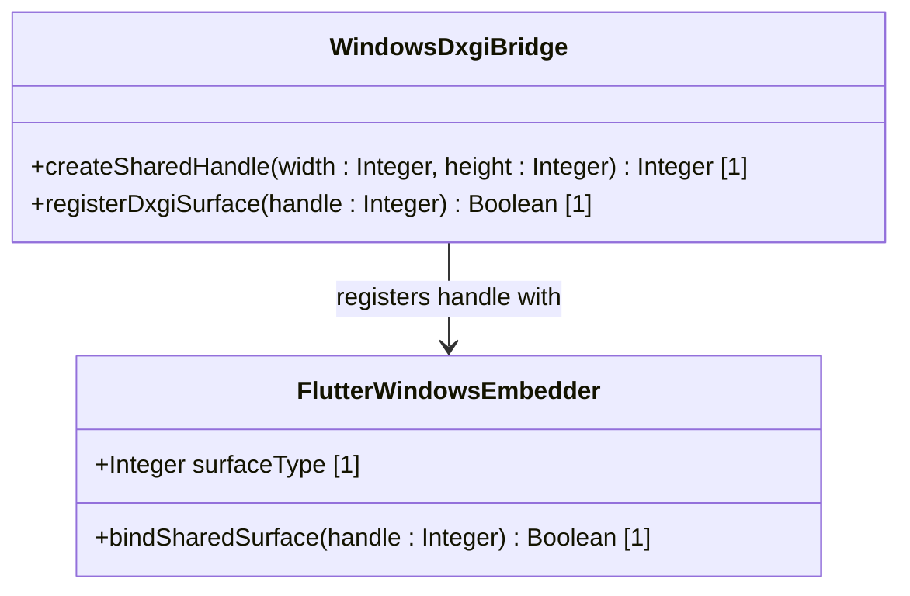

# Feature 47: Windows DXGI Texture Interop

## Parent Epic
- [ ] #248 - [Epic 3: Enterprise 3D Rendering (Zero-Copy GPU Texture Bridge)](https://github.com/gintatkinson/3dgs-phoenix/blob/main/docs/epics/epic-03-gpu-bridge.md) (Provides zero-copy texture sharing and headless renderer orchestration)

## Description
This feature provides Windows DXGI shared handle VRAM interop for zero-copy frame streaming from the offscreen DirectX 12/Vulkan Unreal Engine renderer to the Flutter client. Flutter registers the exported handle and updates the UI texture directly from GPU memory.

## UML Class Diagram


## Interface Requirements

### 1. Payload Schema
```json
{
  "dxgiHandle": "0x0000000000000A1C",
  "width": 1920,
  "height": 1080,
  "surfaceType": "kFlutterDesktopGpuSurfaceTypeDxgiSharedHandle"
}
```

### 2. Validation & Constraints
- Width and height must be positive, non-zero integers.
- The shared handle must be a valid open Windows handle.

### 3. Logical Operations & Interface Messages
- `createSharedHandle(width : Integer, height : Integer) : Integer`: Allocates a shared GPU texture resource and returns its handle.
- `registerDxgiSurface(handle : Integer) : Boolean`: Binds the shared handle into the Flutter desktop texture registrar.

### 4. Logical Exception States & Validation Failures
- **InvalidDxgiHandle:** Raised if the handle cannot be resolved by the graphics API or is null.
- **SurfaceBindingFailure:** Raised if the Windows embedder fails to bind the texture surface.

## Given-When-Then Acceptance Criteria
- **Scenario 1: Binds shared DXGI handle on Windows**
  - **Given** the application is running on Windows
  - **When** Unreal Engine exports a DXGI shared handle
  - **Then** the Flutter Windows embedder registers the handle using `kFlutterDesktopGpuSurfaceTypeDxgiSharedHandle` and draws directly from VRAM.
- **Scenario 2: Catches invalid handle binding error**
  - **Given** the GPU bridge attempts to register a null or invalid handle
  - **When** `registerDxgiSurface()` is called
  - **Then** the system throws an `InvalidDxgiHandle` validation error and falls back to flat rendering.

## Specification Context (Verbatim)
- **Requirement 2.2 (Windows DXGI Interop):** On Windows, the Unreal DirectX 12/Vulkan output must be exported as a DXGI shared handle. Flutter must map this using kFlutterDesktopGpuSurfaceTypeDxgiSharedHandle to sample VRAM directly.

## 4. Source References
Structural Schema: `docs/architecture/Architecture-spec-Cross-Platform-Rendering-and-WebAssembly.md`
Normative Specification: Project Constitution

## 5. Logical UI & Layout Bindings
- **Target LUI Component:** TopologyMap
- **Target Layout Container ID:** topology_pane
- **Data Source Bindings:** token:layout.data_sources.topology
