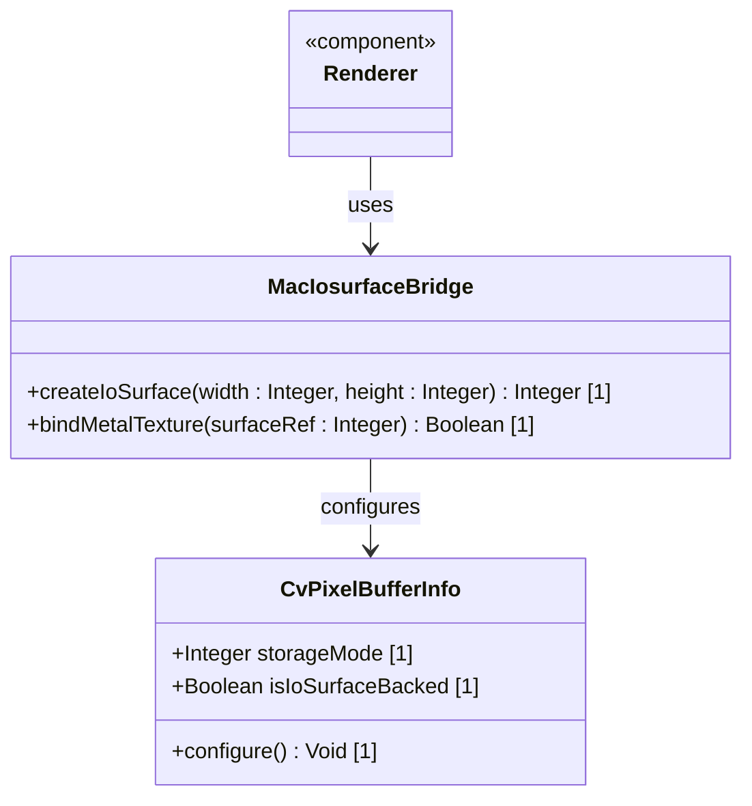

# Feature 48: macOS IOSurface Texture Interop (Issue #253)

## Parent Epic
- [ ] #248 - [Epic 3: Enterprise 3D Rendering (Zero-Copy GPU Texture Bridge)](https://github.com/gintatkinson/3dgs-phoenix/blob/main/docs/epics/epic-03-gpu-bridge.md) (Provides zero-copy texture sharing and headless renderer orchestration)

## Description
This feature provides macOS IOSurface texture VRAM interop for zero-copy frame sharing. The offscreen Apple Metal renderer outputs to a `CVPixelBuffer` backed by an `IOSurfaceRef`. On Apple Silicon, the buffer is configured with `MTLStorageModeShared` to support unified memory architecture and prevent validation errors.

## UML Class Diagram


## Interface Requirements

### 1. Payload Schema
```json
{
  "ioSurfaceRef": 140735492982848,
  "width": 1920,
  "height": 1080,
  "mtlStorageMode": "MTLStorageModeShared"
}
```

### 2. Validation & Constraints
- The `ioSurfaceRef` pointer value must not be zero.
- On Apple Silicon devices, the storage mode constraint must be strictly enforced as `MTLStorageModeShared`.

### 3. Logical Operations & Interface Messages
- `createIoSurface(width : Integer, height : Integer) : Integer`: Allocates macOS IOSurface memory block.
- `bindMetalTexture(surfaceRef : Integer) : Boolean`: Connects the IOSurface buffer to the Metal context.

### 4. Logical Exception States & Validation Failures
- **IoSurfaceCreationFailed:** Raised if the system cannot allocate the `CVPixelBuffer`.
- **MetalValidationError:** Raised if creating a texture with an unsupported storage mode (e.g. `MTLStorageModePrivate` without copying on unified memory).

## Given-When-Then Acceptance Criteria
- **Scenario 1: IOSurface mapping with shared storage mode on Apple Silicon**
  - **Given** the application is running on Apple Silicon macOS hardware
  - **When** the graphics bridge creates the `CVPixelBuffer` backing the IOSurface
  - **Then** the memory layout uses `MTLStorageModeShared` to guarantee unified memory sharing.
- **Scenario 2: Catches Metal validation error**
  - **Given** the application runs on Apple Silicon
  - **When** the texture is created using an unsupported storage configuration
  - **Then** the system catches the validation error, halts the pipeline, and logs the issue.

## Specification Context (Verbatim)
- **Requirement 2.3 (macOS IOSurface Interop):** On macOS, the engine must output to a CVPixelBuffer backed by an IOSurfaceRef. To support Apple Silicon, the buffer must be configured with MTLStorageModeShared.

## 4. Source References
Structural Schema: `docs/architecture/Architecture-spec-Cross-Platform-Rendering-and-WebAssembly.md`
Normative Specification: Project Constitution

## 5. Logical UI & Layout Bindings
- **Target LUI Component:** TopologyMap
- **Target Layout Container ID:** topology_pane
- **Data Source Bindings:** token:layout.data_sources.topology
