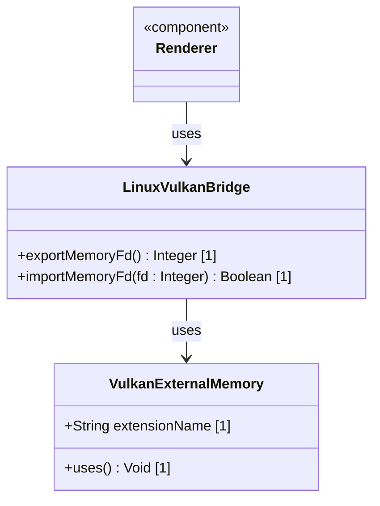

# Feature 49: Linux Vulkan External Memory Interop (Issue #254)

## Parent Epic
- [ ] #248 - [Epic 3: Enterprise 3D Rendering (Zero-Copy GPU Texture Bridge)](https://github.com/gintatkinson/3dgs-phoenix/blob/main/docs/epics/epic-03-gpu-bridge.md) (Provides zero-copy texture sharing and headless renderer orchestration)

## Description
This feature provides Linux Vulkan external memory interop for zero-copy frame sharing. The offscreen Vulkan rendering daemon exposes frame memory via the `VK_KHR_external_memory_fd` extension, yielding a file descriptor (FD). The host process passes the FD over the UDS communication bridge to be imported into the Flutter texture registrar.

## UML Class Diagram


## Interface Requirements

### 1. Payload Schema
```json
{
  "vulkanMemoryFd": 12,
  "extensionName": "VK_KHR_external_memory_fd"
}
```

### 2. Validation & Constraints
- The `vulkanMemoryFd` must be a valid open Linux file descriptor.
- The `extensionName` must be present and match `VK_KHR_external_memory_fd`.

### 3. Logical Operations & Interface Messages
- `exportMemoryFd() : Integer`: Exports Vulkan memory as a file descriptor handle.
- `importMemoryFd(fd : Integer) : Boolean`: Imports the file descriptor handle into Vulkan device memory.

### 4. Logical Exception States & Validation Failures
- **FdExportFailed:** Raised if the Vulkan driver fails to export memory to a file descriptor.
- **FdImportFailed:** Raised if the file descriptor cannot be imported on the host process side due to device mismatches.

## Given-When-Then Acceptance Criteria
- **Scenario 1: Vulkan fd sharing on Linux**
  - **Given** the application is running on Linux
  - **When** the offscreen engine exports the frame memory via the `VK_KHR_external_memory_fd` extension
  - **Then** the file descriptor `12` is passed over UDS and imported into the Flutter texture registrar without memory copying.
- **Scenario 2: Catches file descriptor import failures**
  - **Given** the application runs on Linux
  - **When** an invalid or closed file descriptor `999` is passed
  - **Then** the import operation fails and triggers a `FdImportFailed` exception.

## Specification Context (Verbatim)
- **Requirement 2.4 (Linux Vulkan Interop):** On Linux, the offscreen engine must expose memory via the VK_KHR_external_memory_fd extension, passing the file descriptor over the UDS bridge to the Flutter texture registrar.

## 4. Source References
Structural Schema: `docs/architecture/Architecture-spec-Cross-Platform-Rendering-and-WebAssembly.md`
Normative Specification: Project Constitution

## 5. Logical UI & Layout Bindings
- **Target LUI Component:** TopologyMap
- **Target Layout Container ID:** topology_pane
- **Data Source Bindings:** token:layout.data_sources.topology
