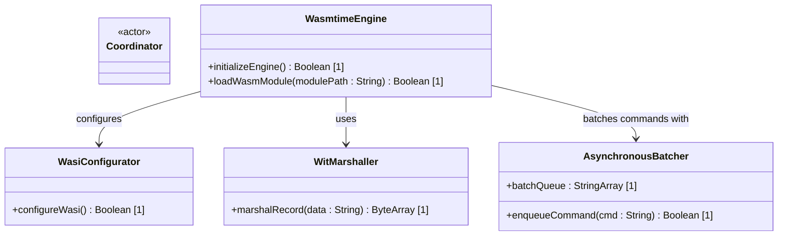

# Feature 50: Wasm Extensibility Subsystem

## Parent Epic
- [ ] #249 - [Epic 4: WebAssembly Component Model Extensibility Epic](https://github.com/gintatkinson/3dgs-phoenix/blob/main/docs/epics/epic-04-wasm-extensibility.md) (Aggregates Wasmtime integration and WIT component interfaces)

## Description
This feature provides the WebAssembly execution subsystem of the platform. It embeds the Rust `wasmtime` engine with Cranelift JIT enabled, configures restricted WASI sandboxes (limiting directory and network access), matches loaded modules against WebAssembly Interface Types (WIT) using `wit-bindgen`, and buffers commands in memory to avoid JIT/native boundary traversal overhead.

## UML Class Diagram


## Interface Requirements

### 1. Payload Schema
```json
{
  "modulePath": "plugins/billing.wasm",
  "wasiAllowedDirs": ["/tmp/billing_db"],
  "allowNetwork": false,
  "commands": [
    {
      "op": "calculate_billing",
      "payload": "{\"userId\":\"usr-101\",\"nodesCount\":24}"
    }
  ]
}
```

### 2. Validation & Constraints
- Wasm modules must validate against standard WASM JIT specifications.
- Allowed directory structures must reside entirely inside the temporary directory. Network access is disabled by default.

### 3. Logical Operations & Interface Messages
- `enqueueCommand(cmd : String) : Boolean`: Buffers a plugin command in the memory queue.
- `flushBatch() : Boolean`: Flushes queued buffer across the FFI boundary to the JIT engine.

### 4. Logical Exception States & Validation Failures
- **WasiSandboxViolation:** Raised if a plugin attempts to read or write files outside the allowed folder namespace.
- **WitInterfaceMismatch:** Raised if the loaded plugin exports/imports do not match the expected `.wit` signature.

## Given-When-Then Acceptance Criteria
- **Scenario 1: Load plugin in sandbox**
  - **Given** the Wasmtime runtime is initialized with Cranelift JIT
  - **When** a valid `.wasm` plugin matching the WIT interface is loaded
  - **Then** the module is instantiated within a restricted WASI sandbox with no network access and access limited to `/tmp/billing_db`.
- **Scenario 2: Command batching prevents boundary bottleneck**
  - **Given** the rendering loop is running at 60 FPS
  - **When** 100 plugin commands are generated
  - **Then** the commands are queued in `AsynchronousBatcher` and executed in a single memory block flush across the JIT FFI boundary, preventing FFI overhead.
- **Scenario 3: Restrict network capability**
  - **Given** a plugin configuration that has `allowNetwork: false`
  - **When** the plugin attempts to open a TCP connection inside the sandbox
  - **Then** the WASI environment blocks the operation and raises a `WasiSandboxViolation`.

## Specification Context (Verbatim)
- **Requirement 4.1 (Wasmtime Runtime):** The Global Coordinator must embed the Rust wasmtime runtime. The cranelift JIT compiler should be enabled for near-native execution speeds.
- **Requirement 4.2 (WASI Sandbox):** Plugins must run inside a strictly defined WebAssembly System Interface (WASI) context. Network access and file system access (e.g., local database directories) must be explicitly granted per-plugin.
- **Requirement 4.3 (WIT Interfaces):** Plugins must adhere to WebAssembly Interface Types (WIT). The interface must define complex types (e.g., records, results) to handle asynchronous data streams without manual memory marshaling. Use wit-bindgen to automate Rust bindings.
- **Requirement 4.4 (Asynchronous Batching):** To prevent Foreign Function Interface (FFI) bottlenecks during 60 FPS render loops, plugin commands must be aggressively batched in memory before crossing the WIT boundary.
- **UC-2: Loading a Third-Party Billing Plugin:** User installs a compiled .wasm extension for a proprietary billing system. The Wasmtime engine evaluates the plugin against the pre-defined .wit interface. If the interface matches, the plugin is loaded into the WASI sandbox. It receives a restricted directory handle and calculates billing metrics, passing the safe result back to the Dart UI without accessing host OS APIs.

## 4. Source References
Structural Schema: `docs/architecture/Architecture-spec-Cross-Platform-Rendering-and-WebAssembly.md`
Normative Specification: Project Constitution

## 5. Logical UI & Layout Bindings
- **Target LUI Component:** TableView
- **Target Layout Container ID:** components_table
- **Data Source Bindings:** token:layout.data_sources.components
