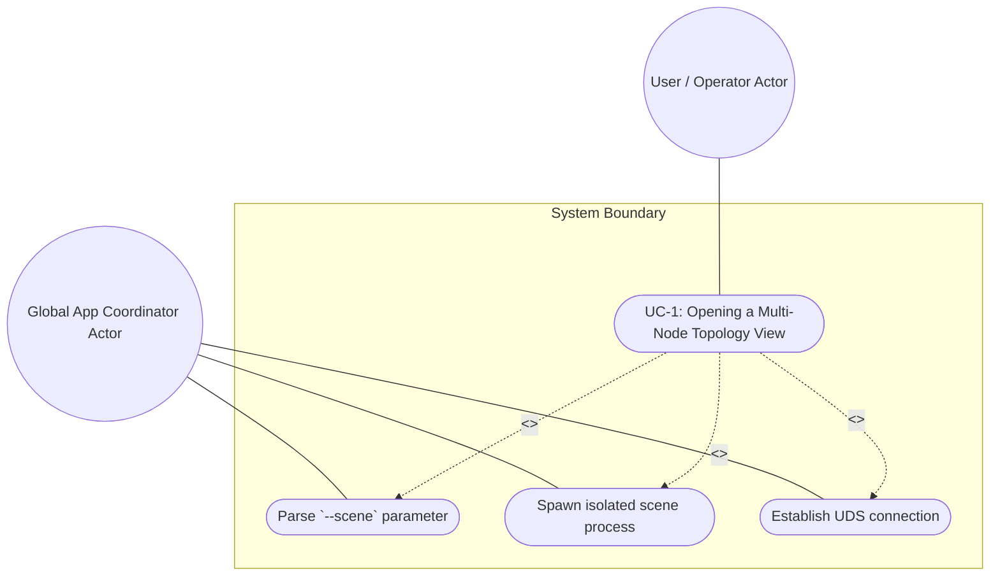
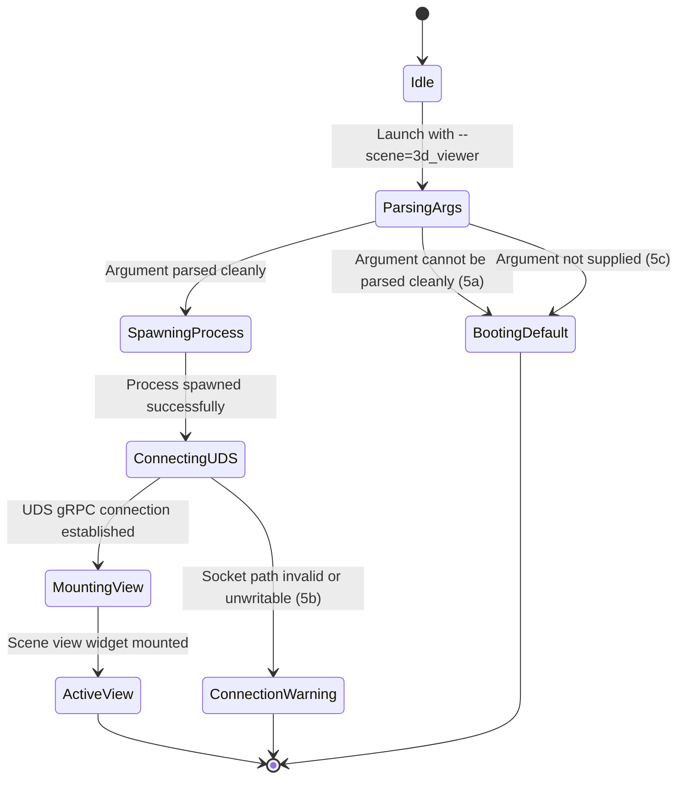

# Use Case UC-1: Opening a Multi-Node Topology View

## UML Diagrams

### Use Case Diagram

### State Machine Diagram

## 1. Actors
- **Primary Actor:** User / Operator (Requests multi-node topology view)
- **Secondary Actor:** Global App Coordinator (Spawns and configures the child process)

## 2. Preconditions
- The application is running, and the Global App Coordinator is active.
- The host operating system has a temporary directory that is writable.

## 3. Trigger
- The User requests the multi-node topology view (by launching the app with `--scene=3d_viewer`).

## 4. Main Success Scenario
1. The User starts the application with the command-line argument `--scene=3d_viewer`.
2. The Global App Coordinator parses the `--scene` command-line argument cleanly.
3. The Global App Coordinator spawns an isolated scene process.
4. The Global App Coordinator establishes a gRPC connection over Unix Domain Sockets (UDS) with the scene process.
5. The Scene View Widget container is mounted as the root view and displays the 3D multi-node topology view.

## 5. Alternate and Exception Flows
- **5a. `--scene` parameter cannot be parsed cleanly (Branches from Basic Flow step 2):**
  1. Global App Coordinator detects a malformed or invalid scene parameter and logs a warning.
  2. Global App Coordinator aborts isolated scene boot and boots into default `MainShell`.
- **5b. Socket path contains spaces or is not in a writable temp directory (Branches from Basic Flow step 4):**
  1. Global App Coordinator detects that the socket path has spaces or is unwritable.
  2. Global App Coordinator aborts the connection, displays a persistent "Connection Lost" warning banner, and logs the path violation.
- **5c. `--scene` parameter is not supplied at boot (Branches from Basic Flow step 1):**
  1. Global App Coordinator detects the absence of the `--scene` parameter.
  2. Global App Coordinator skips the isolated scene boot and loads the default `MainShell` dashboard view.

## 6. Postconditions
- **Success Guarantee:** The multi-node topology view runs in an isolated process with a dedicated Flutter engine, while the Global App Coordinator remains unaffected by crashes in the scene window.
- **Failure/Abort Guarantee:** The application reverts to the default `MainShell` dashboard, cleanup routines delete any stale UDS socket files, and the error state is logged.

## 8. Realization Matrix

### Required User Stories
- [x] #256 - [CommandLine Scene Argument Routing](https://github.com/gintatkinson/3dgs-phoenix/blob/main/docs/user-stories/us-45-1-boot-args.md) (Ensures proper parsing of startup command-line arguments to trigger scene boot)
- [x] #257 - [Fault-Segregated Scene Communication via UDS](https://github.com/gintatkinson/3dgs-phoenix/blob/main/docs/user-stories/us-45-2-grpc-uds.md) (Provides secure, fault-segregated process communication channel)
- [x] #258 - [macOS Dock Icon Supression Compliance](https://github.com/gintatkinson/3dgs-phoenix/blob/main/docs/user-stories/us-45-3-mac-dock.md) (Prevents dock clutter on macOS platforms)

### Required Features
- [x] #250 - [Feature 45: Isolated Scene Boot](https://github.com/gintatkinson/3dgs-phoenix/blob/main/docs/features/feat-45-isolated-scene-boot.md) (Coordinates the startup and lifecycle of isolated render processes)
