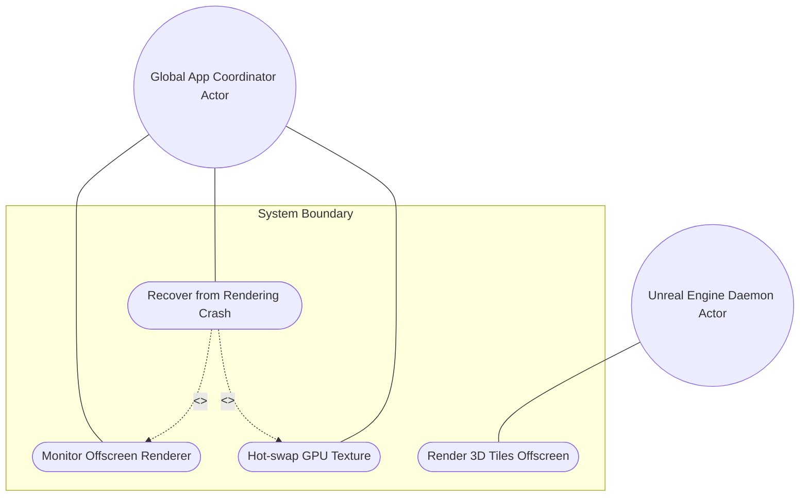
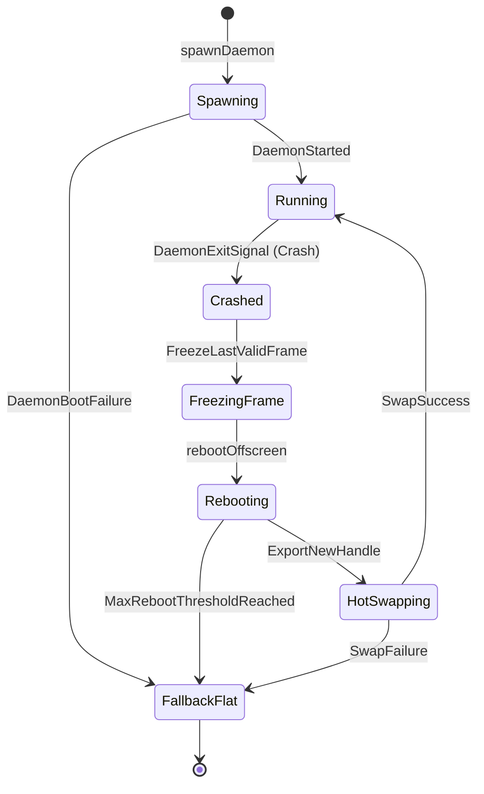

# Use Case UC-3: Handling an Unreal Engine Rendering Crash and seamless hot-swap

## UML Diagrams

### Use Case Diagram

### State Machine Diagram

## 1. Actors
- **Primary Actor:** Global App Coordinator (Spawns, monitors, and recovers the daemon process)
- **Secondary Actor:** Unreal Engine Daemon (Renders 3D tiles offscreen)

## 2. Preconditions
- Unreal Engine Daemon is running offscreen under the monitor of the Global App Coordinator.
- The shared graphics interop surface has been mapped into the Flutter client texture registry.

## 3. Trigger
- The Unreal Engine Daemon crashes (e.g., due to a malformed Photorealistic 3D Tile from Cesium ion).

## 4. Main Success Scenario
1. The Unreal Engine Daemon crashes, sending an exit signal to the host system.
2. The Global App Coordinator detects the child process exit code via the Process Watcher.
3. The Flutter Texture widget freezes on the last valid GPU frame, preventing black screens or flickers.
4. The Coordinator reboots the Unreal Engine Daemon offscreen with `-RenderOffscreen`.
5. The Coordinator exports a new shared graphics memory handle (DXGI shared handle, IOSurface, or Vulkan external FD) from the rebooted daemon.
6. The Coordinator hot-swaps the new memory address into the active Flutter Texture widget seamlessly, resuming the 3D rendering stream.

## 5. Alternate and Exception Flows
- **5a. Daemon executable path does not point to a valid executable (Branches from Basic Flow step 4):**
  1. Coordinator detects that the daemon path is invalid or execution failed (`DaemonBootFailure`).
  2. Coordinator halts launch, logs the boot failure, and falls back to flat rendering mode.
  * **State Guarantee:** Fallback to flat rendering is active; system does not attempt further daemon boot cycles.
- **5b. Executable arguments list does not contain `-RenderOffscreen` (Branches from Basic Flow step 4):**
  1. Coordinator detects that the spawn arguments list is missing `-RenderOffscreen`.
  2. Coordinator halts process spawner, logs a validation failure, and aborts the boot.
  * **State Guarantee:** System halts initialization and logs argument mismatch error; the invalid configuration is rejected.
- **5c. Daemon crashes continuously exceeding reboot threshold (Branches from Basic Flow step 4):**
  1. Watcher detects that the daemon reboot count has exceeded the limit (`MaxRebootThresholdReached`) within 60 seconds.
  2. Coordinator halts the auto-reboot loop, logs a permanent failure, and displays a permanent connection lost warning banner.
  * **State Guarantee:** Auto-reboot loop is disabled; system maintains the UI frozen or warns the user, refusing to spawn the daemon.
- **5d. Requested texture width/height are invalid (Branches from Basic Flow step 5):**
  1. Coordinator detects that the requested width or height is less than or equal to zero.
  2. Coordinator aborts surface allocation, logs the invalid dimensions, and reverts to flat rendering.
  * **State Guarantee:** Reverted to flat rendering; no corrupt texture allocation is performed.
- **5e. DXGI shared handle is invalid/null on Windows (Branches from Basic Flow step 5):**
  1. Coordinator detects that the returned DXGI handle is null or invalid (`InvalidDxgiHandle`).
  2. Coordinator aborts binding, logs `SurfaceBindingFailure`, and falls back to flat rendering mode.
  * **State Guarantee:** Reverted to flat rendering; Windows embedder texture registrar remains stable without referencing invalid memory.
- **5f. IOSurface pointer is zero on macOS (Branches from Basic Flow step 5):**
  1. Coordinator detects that `ioSurfaceRef` is null or zero (`IoSurfaceCreationFailed`).
  2. Coordinator logs the allocation failure, notifies the operator, and halts Metal binding.
  * **State Guarantee:** Metal rendering context remains unmapped to the texture registrar; fallback mode is engaged.
- **5g. Metal storage mode is not MTLStorageModeShared on Apple Silicon macOS (Branches from Basic Flow step 5):**
  1. Coordinator detects that the texture storage mode is not configured as `MTLStorageModeShared` (`MetalValidationError`).
  2. Coordinator catches the validation error, halts the pipeline, and logs the configuration error.
  * **State Guarantee:** The system halts texture creation before rendering to prevent kernel/hardware panics on Apple Silicon.
- **5h. Vulkan file descriptor is invalid or closed on Linux (Branches from Basic Flow step 5):**
  1. Coordinator detects that the file descriptor `vulkanMemoryFd` is invalid or closed (`FdImportFailed`).
  2. Coordinator logs import failure, triggers cleanup, and falls back to flat rendering mode.
  * **State Guarantee:** Reverted to flat rendering; Vulkan device memory mappings are cleaned up without resource leaks.

## 6. Postconditions
- **Success Guarantee:** The Unreal Engine daemon is successfully restarted and the new graphics texture handle is hot-swapped into the Flutter texture registrar without UI freezing or process restart.
- **Failure/Abort Guarantee:** The system halts auto-restart loops if threshholds are exceeded, keeps the last valid frame frozen or displays a connection lost banner, and logs the detailed failure states.

## 8. Realization Matrix

### Required User Stories
- [x] #259 - [Headless Unreal Daemon Orchestration & Spawn Monitoring](https://github.com/gintatkinson/3dgs-phoenix/blob/main/docs/user-stories/us-46-1-spawn-monitoring.md) (Handles background daemon launching and exit signal tracking)
- [x] #260 - [Windows DXGI VRAM Sharing](https://github.com/gintatkinson/3dgs-phoenix/blob/main/docs/user-stories/us-47-1-dx12-vram-sharing.md) (Enables zero-copy DirectX 12 graphics interop on Windows host)
- [x] #261 - [macOS Metal/IOSurface VRAM Sharing](https://github.com/gintatkinson/3dgs-phoenix/blob/main/docs/user-stories/us-48-1-metal-vram-sharing.md) (Enables zero-copy IOSurface frame mapping on Apple Silicon/macOS)
- [x] #262 - [Linux Vulkan External Memory VRAM Sharing](https://github.com/gintatkinson/3dgs-phoenix/blob/main/docs/user-stories/us-49-1-vulkan-vram-sharing.md) (Enables Vulkan external memory FD transfer on Linux)

### Required Features
- [x] #251 - [Feature 46: Headless Unreal Daemon Orchestration](https://github.com/gintatkinson/3dgs-phoenix/blob/main/docs/features/feat-46-headless-orchestration.md) (Spawns and monitors the offscreen renderer)
- [x] #252 - [Feature 47: Windows DXGI Texture Interop](https://github.com/gintatkinson/3dgs-phoenix/blob/main/docs/features/feat-47-windows-dxgi-interop.md) (Handles graphics binding for Windows platforms)
- [x] #253 - [Feature 48: macOS IOSurface Texture Interop](https://github.com/gintatkinson/3dgs-phoenix/blob/main/docs/features/feat-48-macos-iosurface-interop.md) (Handles graphics binding for macOS/Apple Silicon)
- [x] #254 - [Feature 49: Linux Vulkan External Memory Interop](https://github.com/gintatkinson/3dgs-phoenix/blob/main/docs/features/feat-49-linux-vulkan-interop.md) (Handles graphics binding for Linux platforms)
