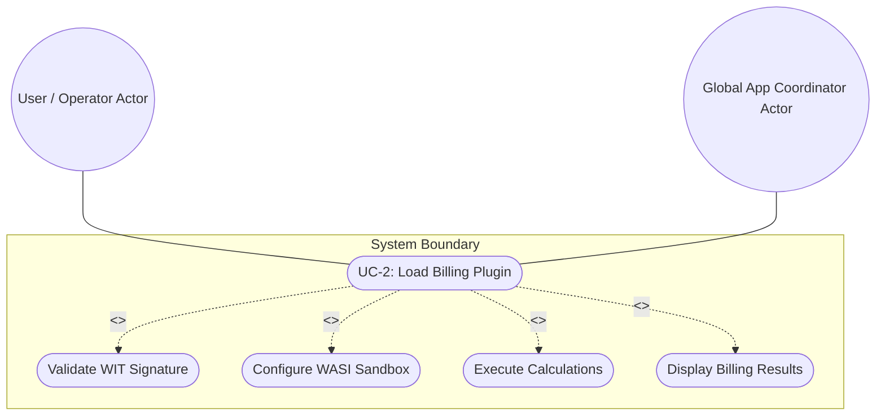
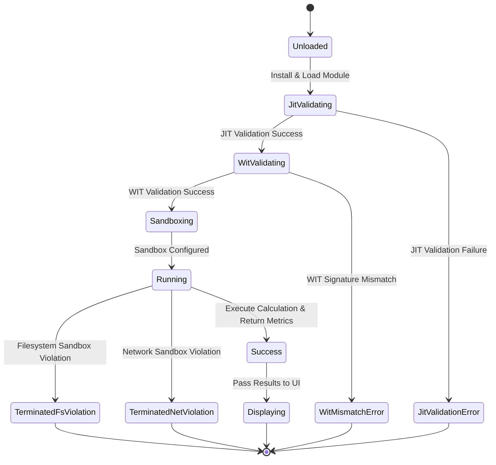

# Use Case UC-2: Loading a Third-Party Wasm Billing Plugin

## UML Diagrams

### Use Case Diagram

### State Transition Diagram

## 1. Actors
- **Primary Actor:** User / Operator (Installs and runs the plugin)
- **Secondary Actor:** Global App Coordinator (Embeds Wasmtime and configures WASI sandboxing)

## 2. Preconditions
- Wasmtime engine with Cranelift JIT is initialized.
- The third-party compiled .wasm billing plugin is available on the local filesystem.

## 3. Trigger
- The User installs or triggers the execution of the compiled .wasm billing plugin.

## 4. Main Success Scenario
1. The User installs the compiled `.wasm` extension for a proprietary billing system.
2. The Global App Coordinator loads and evaluates the plugin against the pre-defined `.wit` interface.
3. The Coordinator instantiates the plugin inside the restricted WASI sandbox.
4. The plugin receives a restricted directory handle inside `/tmp/billing_db`.
5. The plugin performs billing calculations and returns safe result metrics across the WIT boundary.
6. The Coordinator displays the billing results on the Dart UI (TableView widget).

## 5. Alternate and Exception Flows
- **5a. JIT validation fails (Branches from Basic Flow step 2):**
  1. Coordinator detects that the module fails JIT compilation or standard validation.
  2. Coordinator halts the loading, logs the validation exception, and aborts instantiation.
  - **State Guarantee:** The system state remains unmodified; resources are cleaned up, and execution is aborted before instantiation.
- **5b. Filesystem sandbox violation detected (Branches from Basic Flow step 5):**
  1. WASI environment detects that the plugin is attempting to read or write files outside `/tmp/billing_db` (`WasiSandboxViolation`).
  2. WASI blocks the file access, logs the sandbox breach, and terminates the execution.
  - **State Guarantee:** File accesses outside `/tmp/billing_db` are blocked, preventing illegal read/write operations; execution is halted.
- **5c. Network sandbox violation detected (Branches from Basic Flow step 5):**
  1. WASI environment detects that the plugin is attempting to create a network connection (`WasiSandboxViolation` due to `allowNetwork: false`).
  2. WASI blocks the socket call, logs the network access breach, and terminates execution.
  - **State Guarantee:** Network connection request is denied; execution is halted, preventing outgoing sockets or leaks.
- **5d. WIT interface signature mismatch (Branches from Basic Flow step 2):**
  1. Coordinator parses the plugin's WIT interface exports and imports.
  2. Coordinator detects a mismatch with the pre-defined host interface signatures.
  3. Coordinator rejects the plugin, raises a loading error, and notifies the User.
  - **State Guarantee:** Loaded module is rejected, and resources are released, leaving the state unaltered.

## 6. Postconditions
- **Success Guarantee:** The billing plugin executes successfully in a secure sandbox, returning safe results to the UI without accessing host OS APIs directly.
- **Failure/Abort Guarantee:** The system blocks unauthorized actions (file access, network sockets) or malformed modules, terminates execution, cleans up resources, and logs the security/validation exception.

## 8. Realization Matrix

### Required User Stories
- [ ] #263 - [Wasmtime Engine Initialization and Cranelift JIT Configuration](https://github.com/gintatkinson/3dgs-phoenix/blob/main/docs/user-stories/us-50-1-jit-init.md) (Implements Wasmtime JIT initialization)
- [ ] #264 - [WASI Filesystem Sandboxing and Capability Allocation](https://github.com/gintatkinson/3dgs-phoenix/blob/main/docs/user-stories/us-50-2-fs-sandbox.md) (Restricts filesystem capabilities)
- [ ] #265 - [WASI Network Capability Isolation](https://github.com/gintatkinson/3dgs-phoenix/blob/main/docs/user-stories/us-50-3-net-sandbox.md) (Disables/isolates network capabilities)
- [ ] #266 - [WIT Bindgen data streaming type validation](https://github.com/gintatkinson/3dgs-phoenix/blob/main/docs/user-stories/us-50-4-wit-validation.md) (Enforces WIT bindgen interfaces)
- [ ] #267 - [Asynchronous FFI batching queue execution](https://github.com/gintatkinson/3dgs-phoenix/blob/main/docs/user-stories/us-50-5-ffi-batching.md) (Aggressively batches FFI commands to prevent render loop lag)

### Required Features
- [ ] #255 - [Feature 50: Wasm Extensibility Subsystem](https://github.com/gintatkinson/3dgs-phoenix/blob/main/docs/features/feat-50-wasm-extensibility.md) (Provides sandboxed runtime and component model extensibility)
