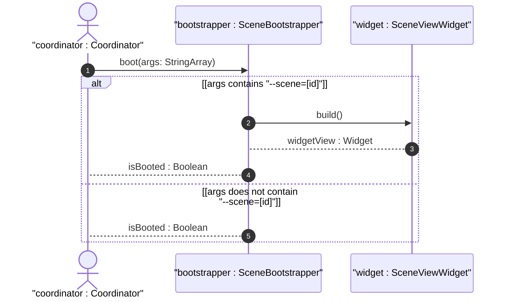

# User Story US-45-1: CommandLine Scene Argument Routing

## Parent Epic
- [ ] #247 - [Epic 1: Platform-Agnostic Scene-Based Lifecycle (Windowing) Epic](https://github.com/gintatkinson/3dgs-phoenix/blob/main/docs/epics/epic-01-scene-lifecycle.md) (Aggregates multi-process windowing logic)

## Domain Object Mapping
- **Primary Domain Objects:** SceneBootstrapper, SceneViewWidget
- **Actor/Role:** coordinator : Coordinator (Host main application process coordinator)

## BDD Scenario (OOA/OOD Realization)
**Given** the app is started with a list of command line arguments
**When** the coordinator calls SceneBootstrapper.boot()
**Then** the bootstrapper parses the arguments, and if --scene=[id] is present, instantiates and builds SceneViewWidget with the target sceneId, returning true. If --scene is not present, it returns false and boots the default MainShell.

## UML Sequence Diagram

## Required Features
- [ ] #250 - [Feature 45: Isolated Scene Boot](https://github.com/gintatkinson/3dgs-phoenix/blob/main/docs/features/feat-45-isolated-scene-boot.md) (CommandLine Scene Argument Routing)

## Source References
Structural Schema: `docs/architecture/Architecture-spec-Cross-Platform-Rendering-and-WebAssembly.md`
Normative Specification: Project Constitution
