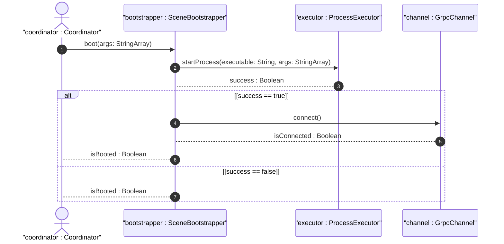

# User Story US-45-2: Fault-Segregated Scene Communication via UDS

## Parent Epic
- [x] #247 - [Epic 1: Platform-Agnostic Scene-Based Lifecycle (Windowing) Epic](https://github.com/gintatkinson/3dgs-phoenix/blob/main/docs/epics/epic-01-scene-lifecycle.md) (Aggregates multi-process windowing logic)

## Domain Object Mapping
- **Primary Domain Objects:** SceneBootstrapper, ProcessExecutor, GrpcChannel
- **Actor/Role:** coordinator : Coordinator (Host main application process coordinator)

## BDD Scenario (OOA/OOD Realization)
**Given** the host coordinator process is booted
**When** a new scene process is spawned and socket path is configured
**Then** the coordinator initializes a GrpcChannel over Unix Domain Sockets (UDS) at the socket path to ensure fault segregation.

## UML Sequence Diagram

## Required Features
- [x] #250 - [Feature 45: Isolated Scene Boot](https://github.com/gintatkinson/3dgs-phoenix/blob/main/docs/features/feat-45-isolated-scene-boot.md) (Fault-Segregated Scene Communication via UDS)

## Source References
Structural Schema: `docs/architecture/Architecture-spec-Cross-Platform-Rendering-and-WebAssembly.md`
Normative Specification: Project Constitution
