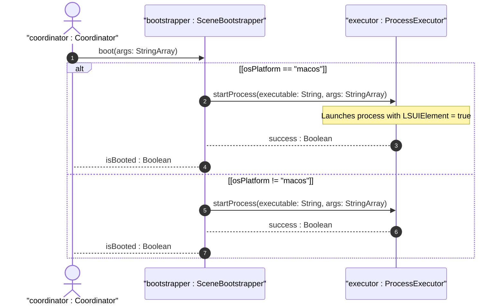

# User Story US-45-3: macOS Dock Icon Supression Compliance

## Parent Epic
- [ ] #247 - [Epic 1: Platform-Agnostic Scene-Based Lifecycle (Windowing) Epic](https://github.com/gintatkinson/3dgs-phoenix/blob/main/docs/epics/epic-01-scene-lifecycle.md) (Aggregates multi-process windowing logic)

## Domain Object Mapping
- **Primary Domain Objects:** SceneBootstrapper, ProcessExecutor
- **Actor/Role:** coordinator : Coordinator (Host main application process coordinator)

## BDD Scenario (OOA/OOD Realization)
**Given** the application is running on macOS
**When** the coordinator boots a scene process via the spawner
**Then** the target bundle is launched as a helper element with `LSUIElement` key enabled to prevent a Dock icon.

## UML Sequence Diagram

## Required Features
- [x] #250 - [Feature 45: Isolated Scene Boot](https://github.com/gintatkinson/3dgs-phoenix/blob/main/docs/features/feat-45-isolated-scene-boot.md) (macOS Dock Icon Supression Compliance)

## Source References
Structural Schema: `docs/architecture/Architecture-spec-Cross-Platform-Rendering-and-WebAssembly.md`
Normative Specification: Project Constitution
