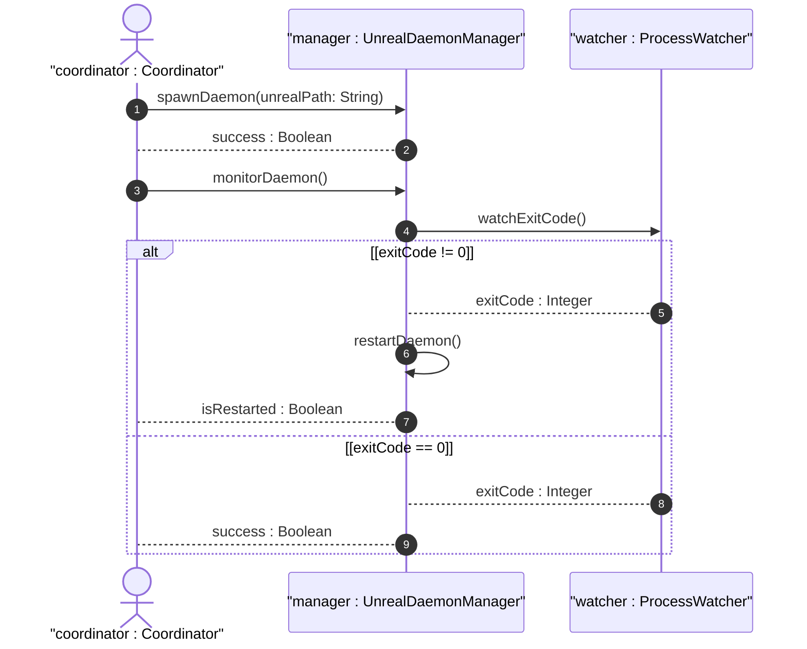

# User Story US-46-1: Headless Unreal Daemon Orchestration & Spawn Monitoring

## Parent Epic
- [ ] #248 - [Epic 3: Enterprise 3D Rendering (Zero-Copy GPU Texture Bridge)](https://github.com/gintatkinson/3dgs-phoenix/blob/main/docs/epics/epic-03-gpu-bridge.md) (Provides zero-copy texture sharing and headless renderer orchestration)

## Domain Object Mapping
- **Primary Domain Objects:** UnrealDaemonManager, ProcessWatcher
- **Actor/Role:** coordinator : Coordinator (Host main application process coordinator)

## BDD Scenario (OOA/OOD Realization)
**Given** the coordinator is configured to spawn the offscreen renderer
**When** the Unreal background process is spawned and monitored
**Then** it starts with the `-RenderOffscreen` flag, and its exit codes are monitored by the ProcessWatcher to trigger restarts and texture hot-swaps on failure.

## UML Sequence Diagram

## Required Features
- [x] #251 - [Feature 46: Headless Unreal Daemon Orchestration](https://github.com/gintatkinson/3dgs-phoenix/blob/main/docs/features/feat-46-headless-orchestration.md) (Headless Unreal Daemon Orchestration & Spawn Monitoring)

## Source References
Structural Schema: `docs/architecture/Architecture-spec-Cross-Platform-Rendering-and-WebAssembly.md`
Normative Specification: Project Constitution
