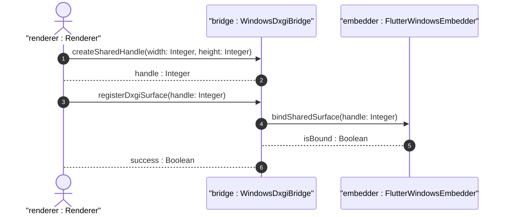

# User Story US-47-1: Windows DXGI VRAM Sharing

## Parent Epic
- [x] #248 - [Epic 3: Enterprise 3D Rendering (Zero-Copy GPU Texture Bridge)](https://github.com/gintatkinson/3dgs-phoenix/blob/main/docs/epics/epic-03-gpu-bridge.md) (Provides zero-copy texture sharing and headless renderer orchestration)

## Domain Object Mapping
- **Primary Domain Objects:** WindowsDxgiBridge, FlutterWindowsEmbedder
- **Actor/Role:** renderer : Renderer (Offscreen Unreal Engine rendering process)

## BDD Scenario (OOA/OOD Realization)
**Given** the application is running on Windows
**When** the offscreen renderer exports the shared handle
**Then** the host process registers the handle with the Flutter Windows embedder to sample VRAM directly.

## UML Sequence Diagram

## Required Features
- [x] #252 - [Feature 47: Windows DXGI Texture Interop](https://github.com/gintatkinson/3dgs-phoenix/blob/main/docs/features/feat-47-windows-dxgi-interop.md) (Windows DXGI VRAM Sharing)

## Source References
Structural Schema: `docs/architecture/Architecture-spec-Cross-Platform-Rendering-and-WebAssembly.md`
Normative Specification: Project Constitution
