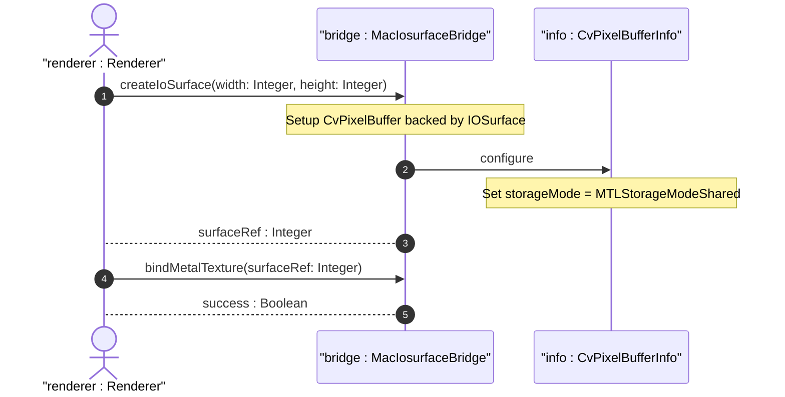

# User Story US-48-1: macOS Metal/IOSurface VRAM Sharing

## Parent Epic
- [ ] #248 - [Epic 3: Enterprise 3D Rendering (Zero-Copy GPU Texture Bridge)](https://github.com/gintatkinson/3dgs-phoenix/blob/main/docs/epics/epic-03-gpu-bridge.md) (Provides zero-copy texture sharing and headless renderer orchestration)

## Domain Object Mapping
- **Primary Domain Objects:** MacIosurfaceBridge, CvPixelBufferInfo
- **Actor/Role:** renderer : Renderer (Offscreen Metal rendering process)

## BDD Scenario (OOA/OOD Realization)
**Given** the application runs on Apple Silicon macOS hardware
**When** the graphics bridge creates the CVPixelBuffer backing the IOSurface
**Then** the storage mode is configured with MTLStorageModeShared to support unified memory architecture and prevent validation errors.

## UML Sequence Diagram

## Required Features
- [x] #253 - [Feature 48: macOS IOSurface Texture Interop](https://github.com/gintatkinson/3dgs-phoenix/blob/main/docs/features/feat-48-macos-iosurface-interop.md) (macOS Metal/IOSurface VRAM Sharing)

## Source References
Structural Schema: `docs/architecture/Architecture-spec-Cross-Platform-Rendering-and-WebAssembly.md`
Normative Specification: Project Constitution
