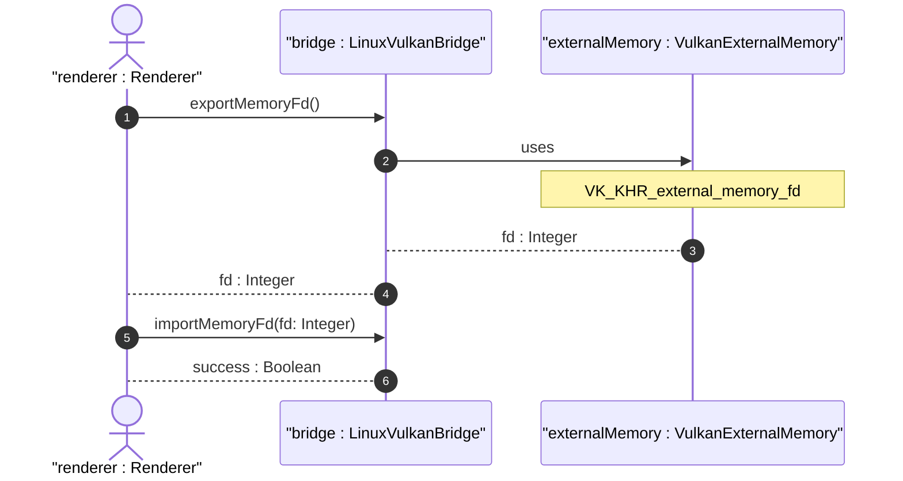

# User Story US-49-1: Linux Vulkan External Memory VRAM Sharing

## Parent Epic
- [ ] #248 - [Epic 3: Enterprise 3D Rendering (Zero-Copy GPU Texture Bridge)](https://github.com/gintatkinson/3dgs-phoenix/blob/main/docs/epics/epic-03-gpu-bridge.md) (Provides zero-copy texture sharing and headless renderer orchestration)

## Domain Object Mapping
- **Primary Domain Objects:** LinuxVulkanBridge, VulkanExternalMemory
- **Actor/Role:** renderer : Renderer (Offscreen Vulkan rendering process)

## BDD Scenario (OOA/OOD Realization)
**Given** the application is running on Linux
**When** the offscreen engine exports the frame memory via the VK_KHR_external_memory_fd extension
**Then** the generated file descriptor is transferred over UDS and imported into the Flutter texture registrar without memory copy.

## UML Sequence Diagram

## Required Features
- [ ] #254 - [Feature 49: Linux Vulkan External Memory Interop](https://github.com/gintatkinson/3dgs-phoenix/blob/main/docs/features/feat-49-linux-vulkan-interop.md) (Linux Vulkan External Memory VRAM Sharing)

## Source References
Structural Schema: `docs/architecture/Architecture-spec-Cross-Platform-Rendering-and-WebAssembly.md`
Normative Specification: Project Constitution
