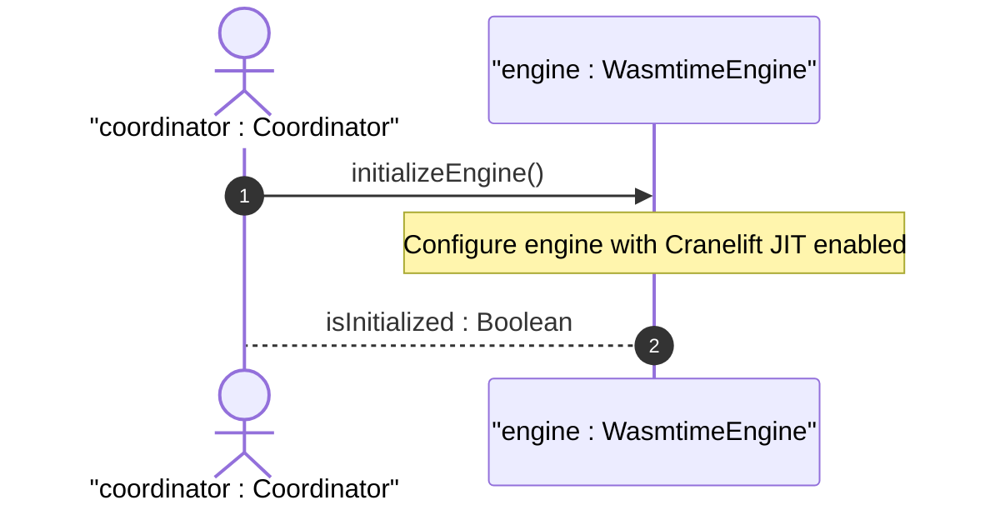

# User Story US-50-1: Wasmtime Engine Initialization and Cranelift JIT Configuration

## Parent Epic
- [x] #249 - [Epic 4: WebAssembly Component Model Extensibility Epic](https://github.com/gintatkinson/3dgs-phoenix/blob/main/docs/epics/epic-04-wasm-extensibility.md) (Aggregates Wasmtime integration and WIT component interfaces)

## Domain Object Mapping
- **Primary Domain Objects:** WasmtimeEngine
- **Actor/Role:** coordinator : Coordinator (Host main application process coordinator)

## BDD Scenario (OOA/OOD Realization)
**Given** the application startup sequence is triggered
**When** the coordinator instantiates the WebAssembly subsystem
**Then** the Wasmtime engine initializes with Cranelift JIT compiler enabled to ensure near-native execution speed.

## UML Sequence Diagram

## Required Features
- [x] #255 - [Feature 50: Wasm Extensibility Subsystem](https://github.com/gintatkinson/3dgs-phoenix/blob/main/docs/features/feat-50-wasm-extensibility.md) (Wasmtime Engine Initialization and Cranelift JIT Configuration)

## Source References
Structural Schema: `docs/architecture/Architecture-spec-Cross-Platform-Rendering-and-WebAssembly.md`
Normative Specification: Project Constitution
