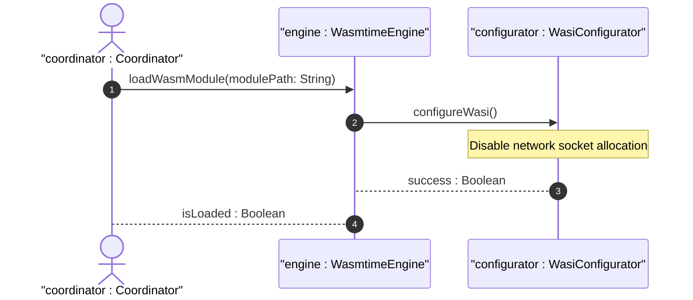

# User Story US-50-3: WASI Network Capability Isolation

## Parent Epic
- [ ] #249 - [Epic 4: WebAssembly Component Model Extensibility Epic](https://github.com/gintatkinson/3dgs-phoenix/blob/main/docs/epics/epic-04-wasm-extensibility.md) (Aggregates Wasmtime integration and WIT component interfaces)

## Domain Object Mapping
- **Primary Domain Objects:** WasmtimeEngine, WasiConfigurator
- **Actor/Role:** coordinator : Coordinator (Host main application process coordinator)

## BDD Scenario (OOA/OOD Realization)
**Given** a WASM plugin configured with network access disabled
**When** the plugin attempts to open a network socket connection
**Then** the sandboxed WASI environment blocks the request and raises a WasiSandboxViolation exception.

## UML Sequence Diagram

## Required Features
- [ ] #255 - [Feature 50: Wasm Extensibility Subsystem](https://github.com/gintatkinson/3dgs-phoenix/blob/main/docs/features/feat-50-wasm-extensibility.md) (WASI Network Capability Isolation)

## Source References
Structural Schema: `docs/architecture/Architecture-spec-Cross-Platform-Rendering-and-WebAssembly.md`
Normative Specification: Project Constitution
