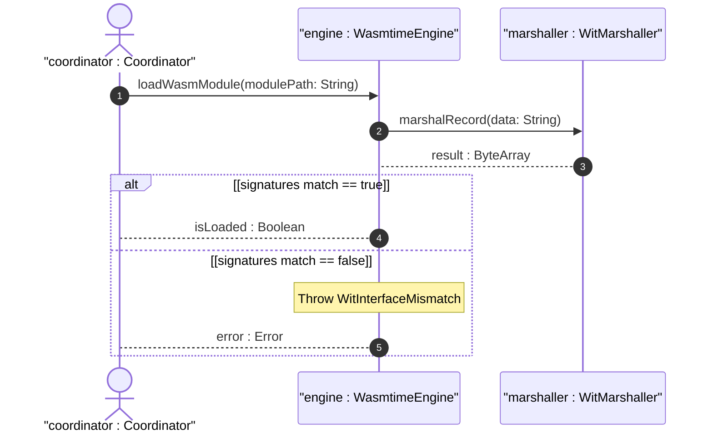

# User Story US-50-4: WIT Bindgen data streaming type validation

## Parent Epic
- [ ] #249 - [Epic 4: WebAssembly Component Model Extensibility Epic](https://github.com/gintatkinson/3dgs-phoenix/blob/main/docs/epics/epic-04-wasm-extensibility.md) (Aggregates Wasmtime integration and WIT component interfaces)

## Domain Object Mapping
- **Primary Domain Objects:** WasmtimeEngine, WitMarshaller
- **Actor/Role:** coordinator : Coordinator (Host main application process coordinator)

## BDD Scenario (OOA/OOD Realization)
**Given** the pre-defined WIT interface defining complex record types
**When** a compiled plugin is loaded into the Wasmtime engine
**Then** the engine checks the exports and imports against the WIT signature, raising a WitInterfaceMismatch if the signatures do not match.

## UML Sequence Diagram

## Required Features
- [x] #255 - [Feature 50: Wasm Extensibility Subsystem](https://github.com/gintatkinson/3dgs-phoenix/blob/main/docs/features/feat-50-wasm-extensibility.md) (WIT Bindgen data streaming type validation)

## Source References
Structural Schema: `docs/architecture/Architecture-spec-Cross-Platform-Rendering-and-WebAssembly.md`
Normative Specification: Project Constitution
