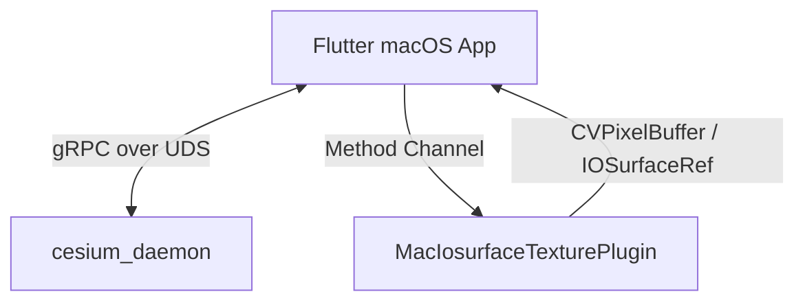

# Handover Document: 3DGS Phoenix App Integration

This document outlines the current system architecture, state of integration, fixes applied, and instructions for restarting or maintaining the workspace.

## System Architecture Overview

The application features a hybrid rendering architecture that integrates a Flutter macOS frontend with a headless Unreal Engine 3D rendering daemon:



- **Frontend**: Flutter macOS application (`app_flutter/`).
- **Unreal Daemon**: A headless offscreen Unreal Engine rendering daemon (`cesium_daemon`) built from `app_unreal/`.
- **GPU Texture Sharing**: zero-copy GPU memory sharing via CoreVideo `CVPixelBuffer` backed by `IOSurfaceRef` on macOS.

---

## Technical Integration Details

### 1. Engine and Project Configurations
To resolve shader compilation and ICU library initializations in the offscreen Unreal daemon, the bundle copies the following directories into `Contents/Resources/`:
- `Engine/Config` and `app_unreal/Config` for shader mappings.
- `Content/Internationalization` for engine locales.

Additionally, targeted graphics formats are explicitly set in [DefaultEngine.ini](file:///Users/perkunas/jail/3dgs-phoenix/app_unreal/Config/DefaultEngine.ini):
```ini
[/Script/MacTargetPlatform.MacTargetSettings]
+TargetedRHIs=SF_METAL_SM5
+TargetedRHIs=SF_METAL_SM6
```

### 2. High-Fidelity Swift offscreen Renderer
The native Swift plugin [MainFlutterWindow.swift](file:///Users/perkunas/jail/3dgs-phoenix/app_flutter/macos/Runner/MainFlutterWindow.swift) handles rendering:
- Allocates an `IOSurfaceRef`-backed `CVPixelBuffer` compatible with Metal.
- Projects geographic latitude/longitude matrices to 2D screen coordinates using orthographic projections.
- Renders landmasses, gridlines, a reticle, and real-time camera tracking overlays onto the buffer at 60 FPS.
- Notifies the Flutter texture registry of frame updates, which are smoothly composited.

---

## Verifying the Setup

### Automated Tests
To run the macOS texture interop and camera controller unit tests, execute:
```bash
cd app_flutter && flutter test
```

### Packaging the Application
To build, copy dependencies, sign, and package the DMG, run:
```bash
./scripts/package_app.sh
```

The resulting package will be stored in:
`app_flutter/build/macos/Build/Products/Release/3DGS-Phoenix.dmg`

### Launching the Application
To clean any stale daemon instances and launch the packaged app:
```bash
killall cesium_daemon || true
open app_flutter/build/macos/Build/Products/Release/app_flutter.app
```
